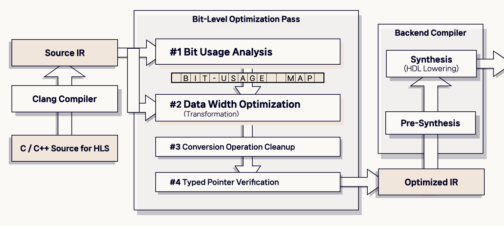

<blockquote style="padding: 1.5rem; background:transparent">
     <br />
    <span><a href="https://www.linkedin.com/in/annariepe/">Anna Riepe</a> &amp; <a href="https://www.fari.brussels/">FARI</a> / <a href="https://betterimagesofai.org/images?artist=AnnaRiepe&title=SeeingMore%E2%80%94SeeingLess">Seeing More — Seeing Less</a> / <a href="https://creativecommons.org/licenses/by/4.0/">Licenced by CC-BY 4.0</a></span>
<hr style="margin: 2rem 0"/>
<p>
컴파일러는 사람이 작성한 Source Code를 받아 하드웨어가 실행할 수 있는 형태로 변환한다. <br />
그 과정에서 컴파일러는 수많은 결정을 내린다. <br />
어떤 레지스터를 쓸지, 어떤 연산을 재배열할지, 어떤 코드를 죽은 코드로 간주할지. <br />
하지만 남은 의문이 있다.
<strong>컴파일러는 각각의 Value가 실제로 몇 비트를 쓰는지 알고 있을까?</strong>
</p>
</blockquote>

## Problem Definition

### Motivation

FPGA(Field-Programmable Gate Array)는 소프트웨어가 아닌 하드웨어 회로를 직접 구성하는 장치다. 딥러닝 추론, 암호화, 신호 처리 등에서 GPU 대비 전력 효율이 뛰어나 AI 가속기 시장에서 주목받는다.

FPGA를 프로그래밍하는 방법은 크게 두 가지다. RTL(Register Transfer Level)로 직접 회로를 설계하거나, C/C++ 코드를 HDL로 자동 변환하는 **High-Level Synthesis(HLS)** 를 사용하는 것이다. HLS는 생산성 측면에서 RTL보다 훨씬 매력적이다. Vitis HLS 같은 도구들이 이 역할을 담당한다. 그런데 HLS에는 근본적인 문제가 있다.

고수준 언어(C/C++)는 값을 `int`, `char` 같은 타입 단위로 다룬다. 하지만 실제 연산에서 그 값의 **모든 비트가 쓰이는 경우는 드물다**. 예를 들어, 어떤 변수가 선언은 `int32_t`로 되어 있지만 실제로는 상위 24비트가 항상 0인 경우가 많다. 암호화 알고리즘이나 통신 프로토콜에서는 이런 패턴이 비일비재하다. 

아래 코드를 보자. SHA-256 알고리즘의 Ch 함수다.


```c

// SHA-256 Choice function
#define Ch(x, y, z) ((z) ^ ((x) & ((y) ^ (z))))

uint32_t x = 0x0000F0F0; // 상위 16비트가 항상 0
uint32_t y = some_value;
uint32_t z = some_value;

uint32_t result = Ch(x, y, z);


```

<br />

`x`의 상위 16비트가 항상 0이기 때문에, `x & (...)` 연산에서 상위 16비트는 어떤 값이 와도 항상 0이다. 이후 XOR 역시 상위 16비트만 전파된다. **최종 결과는 16비트만 의미있게 사용된다.** HLS 컴파일러는 이를 모른다. `uint32_t`이니 32비트 하드웨어 연산자를 생성한다.

다음은 이 상황을 비트 단위로 표현한 것이다.


```

선언된 타입: uint32_t (32비트)
  bit[31]         bit[16] bit[15]       bit[0]
  ┌────────────────────────┬───────────────────┐
  │ 0000 0000 0000 0000    │  실제 사용 영역      │
  │ (낭비: 항상 0)           │  (?? ?? ?? ??)    │
  └────────────────────────┴───────────────────┘

실제 사용량: 16비트
  ┌───────────────────┐
  │  ?? ?? ?? ??      │
  └───────────────────┘

HLS가 생성하는 하드웨어 : 32비트 연산자 3개  → LUT 낭비
HLS가 생성해야 할 하드웨어: 16비트 연산자 3개  → 50% 절감


```

<br />

Zhang et al. [[2]](#ref2)은 이미 2010년에 이 문제를 지적했다. RTL 합성 단계에서 뒤늦게 최적화를 시도하면, HLS가 Pipeline Register를 삽입한 이후라 최적화 범위가 크게 제한된다고. 따라서 C-to-RTL 변환의 초기 단계, 즉 IR 수준에서 비트 레벨 분석과 최적화를 수행하는 것이 효과적일 수 있다는 생각에서 본 연구는 출발했다.

### Goals

해당 연구의 목표는 세 가지로 정리된다.

1. <strong>LLVM IR 수준의 정적 비트 사용량 분석</strong> : 각 명령어가 실제로 어떤 비트를 사용하는지 Compile-Time에 추적하는 알고리즘을 설계한다. Non-Constant Value에 대해서는 LLVM Known-Bits API를 활용해 정밀도를 높인다. <br /><br/>
2. <strong>Data Width 최적화를 통한 IR Transformation</strong> : 분석 결과를 바탕으로 각 Instruction에서 사용하는 데이터의 폭을 최적화하고, 변환 후 IR의 Type 일관성과 의미론적 동등성을 보장한다.  <br/><br/>
3. <strong>Vitis HLS Compilation Pipeline에 통합 및 FPGA Resource 절감 실증</strong> : Analysis / Transformation Pass를 HLS Workflow에 통합하고, CHStone Benchmark에서 실제 LUT / FF 절감을 확인한다.

---

## Strategy: Two-Phase Optimization Algorithm


<p align="left">
    
</p>


<blockquote style="padding: 1.5rem; background:transparent">
    알고리즘은 크게 두 단계, 세부적으로는 네 단계로 구성된다. <br />
Phase 1/2가 각각 <strong>Analysis</strong> 및 <strong>Transformation</strong>에 해당하고, Phase 3/4는 IR 안정성을 보장하기 위한 후처리 단계에 해당한다.
</blockquote>


```cpp

bool BitLevelOpt::runOnFunction(Function &F) {
    DenseMap<Instruction *, uint64_t> BitUsageMap;
    const DataLayout &DL = F.getParent()->getDataLayout();

    // Phase 1: 분석 — 전체 함수 순회 후 BitUsageMap 완성
    for (auto &BB : F)
        for (auto &I : BB)
            analyzeBitUsage(&I, BitUsageMap, DL);

    // Phase 2: 변환 — Map을 참조해 IR 재작성
    optimizeDataWidth(F, BitUsageMap);

    // Phase 3 & 4: 후처리
    optimizeConversionOp(F);
    verifyStoreInstructions(F);

    return true;
}


```

### Phase 1 — Bit-Usage Analysis

분석 단계에서는 각 명령어(Instruction)가 실제로 어떤 비트를 사용하는지 추적한다.

핵심 아이디어는 **역방향 def-use 체인 순회**다. 보통 데이터 흐름 분석은 정의(def)에서 사용(use) 방향으로 순전파(forward)한다. 하지만 비트 사용량 분석은 반대다. 어떤 비트가 *사용되는지*는 그 값의 **소비자(consumer)** 가 결정하기 때문이다.


```
I.users() 를 순회 → 각 사용자 U에 대해:

  ZExt/SExt/Trunc : 재귀 분석 후 폭 제한 마스크 적용
  And             : U의 비트 사용량 ∩ 다른 피연산자의 Known-Bits
  Shl (n)         : U의 비트 사용량 >> n   (역방향: 왼쪽 shift의 역은 오른쪽)
  LShr/AShr (n)   : U의 비트 사용량 << n   (역방향)
  URem (2^k)      : U의 비트 사용량 & (2^k − 1)
  GEP / 기타       : 선언 타입 폭 전체 (보수적)
```

<br/>

<code class="language-text">AND</code> 연산의 Bit Usage 전파 예시는 아래와 같다.


```
%result = and i32 %x, 0x0000FFFF   ; 하위 16비트 마스킹

BUA(%x) 계산:
  - 사용처: and i32 %x, 0x0000FFFF
  - BUA(%result) = ?  (후속 사용처에 따라 결정됨)
  - nonIOperand  = 0x0000FFFF
  - Known-Bits(0x0000FFFF) = 0x0000FFFF
  - bitUsage(%x) |= BUA(%result) & 0x0000FFFF = 0x0000FFFF

→ %x는 하위 16비트만 사용 → i16으로 축소 가능
```

<br />

실제 구현에서 AND 및 Shift Case 처리는 다음과 같이 진행된다.


```cpp

switch (binInst->getOpcode()) {
    case Instruction::And:
        // 사용처 비트 사용량 ∩ 다른 피연산자의 Known-Bits
        bitUsage = bitUsage | (bitUsage_U & nonIOperandBitUsage);
        break;

    case Instruction::Shl:
        // %y = shl %x, n → %x의 사용량 = %y 사용량 >> n (역방향)
        bitUsage = bitUsage | (bitUsage_U >> constantOperand->getZExtValue());
        break;

    case Instruction::LShr:
    case Instruction::AShr:
        // %y = lshr %x, n → %x의 사용량 = %y 사용량 << n (역방향)
        bitUsage = bitUsage | (bitUsage_U << constantOperand->getZExtValue());
        break;

    default:
        // 불명 연산: 보수적으로 전체 비트 사용
        bitUsage = bitUsage | bitUsage_U;
        break;
}


```

<br />

분석 결과는 `DenseMap<Instruction*, uint64_t>` 형태의 **Bit-Usage Map**으로 저장된다. 각 명령어에 대해 실제로 사용되는 비트를 64bit Mask 형태로 기록한다.

### Phase 2 — Data Width Optimization

분석 결과를 바탕으로 IR을 변환하는 단계다. BUA Map에서 각 명령어의 최적 데이터 폭을 결정하고, 해당 폭의 새 명령어로 교체한다.


```cpp
// 최상위 set bit 위치로 최적 원시 타입 결정
Type* BitLevelOpt::getOptimizedPrimitiveType(Instruction &I, uint64_t bitUsage) {
    uint8_t bitWidth = 0;
    for (int i = 63; i >= 0; i--) {
        if (((bitUsage >> i) & 1) == 1) { bitWidth = i + 1; break; }
    }
    if (bitWidth <= 8)  return Type::getInt8Ty(I.getContext());
    if (bitWidth <= 16) return Type::getInt16Ty(I.getContext());
    if (bitWidth <= 32) return Type::getInt32Ty(I.getContext());
    return Type::getInt64Ty(I.getContext());
}
```

피연산자 폭이 달라지는 경우 `zext`(zero-extension) 명령어를 삽입해 타입 일관성을 보장하고, 변경된 명령어의 모든 사용처에 재귀적으로 최적화를 전파한다.

<br />

## First Approach

초기 구현은 기존 JSA 논문 [[1]](#ref1)의 접근을 HLS 환경으로 이식하는 것에서 시작했다. 해당 연구는 AVR 마이크로컨트롤러를 타겟으로 하는 임베디드 시스템용 비트 수준 최적화로, MiBench 벤치마크에서 최대 19.8%의 명령어 수 감소를 달성했다.

이 알고리즘의 핵심은 **상수 피연산자에 대한 비트마스크 전파**다. AND 연산에서 한쪽 피연산자가 상수인 경우, 그 마스크 패턴을 그대로 비트 사용량으로 기록할 수 있다. Shift 연산에서는 shift amount만큼 비트 사용량을 이동시킨다. 초기에는 이 로직만으로 MiBench의 bitcount(17.95%), crc32(15.41%) 등에서 의미있는 비트폭 감소를 확인했다.

<br />

## Obstacles

### On-time Transformation

처음에는 분석과 변환을 하나의 패스에서 동시에 수행하려 했다. 하지만 이는 IR 안정성에 있어 근본적인 문제를 야기했다. 명령어 A를 변환해 타입을 `i32` → `i16`으로 바꾸면, A를 사용하는 명령어 B가 아직 변환되지 않은 상태다. B는 여전히 `i32`를 기대하는데 `i16`을 받게 되어 IR Verifier 오류가 발생한다.

해결책은 **Two-Pass 분리**였다. 전체 함수를 순회해 BitUsageMap을 완성한 뒤, 두 번째 패스에서 Map을 참조해 변환을 수행한다. 그런데 두 번째 패스에서도 흥미로운 문제가 있다.

`buildOptimizedInstruction`은 재귀적으로 동작한다. 명령어 I를 변환하면, I의 모든 사용처(user)에 대해 재귀적으로 `buildOptimizedInstruction`을 호출해 변경이 def-use 체인을 따라 아래 방향으로 전파된다.


```cpp
// 변환 완료 후 → 사용처에 재귀 전파
I->replaceAllUsesWith(newInst);
I->eraseFromParent();

for (auto *U : newInst->users()) {
    // 인터페이스 명령어(store, return, branch)는 건너뜀
    if (isa<StoreInst>(U) || isa<ReturnInst>(U) || isa<BranchInst>(U))
        continue;

    if (auto *userInst = dyn_cast<Instruction>(U)) {
        Type *userOptType = getOptimizedPrimitiveType(*newInst, BitUsageMap[userInst]);
        // 재귀 호출: 사용처도 최적화
        buildOptimizedInstruction(BitUsageMap, userInst, userOptType, optInstWidth);
    }
}
```

<br />

피연산자 타입이 불일치하는 경우, 좁은 쪽에서 넓은 쪽으로 `zext`를 삽입해 타입 일관성을 보장한다.


```cpp
// 두 피연산자 폭이 다를 때 zext로 맞춤
if (firstWidth > secondWidth) {
    operand2 = IRBuilder.CreateZExtOrTrunc(operand2, firstOperandDataType);
} else if (firstWidth < secondWidth) {
    operand1 = IRBuilder.CreateZExtOrTrunc(operand1, secondOperandDataType);
}
```

<br />

또한 Shift 연산에서는 추가적인 안전 검사가 필요했다. Shift amount가 피연산자 비트폭 이상이 되면 LLVM에서 **poison value**가 발생한다. 따라서 `isSafeShiftOperation()` 검사를 통해 shift amount ≥ operand bit-width인 경우 변환을 건너뛰는 로직을 추가했다.

### Opaque Pointer: LLVM 버전 간극

더 까다로운 문제가 있었다. Vitis HLS는 내부적으로 LLVM 7.0 기반의 clang-3.9-csynth를 사용한다. LLVM 15부터 Opaque Pointer가 기본값이 됐고, LLVM 17에서는 Typed Pointer 지원이 완전히 제거됐다.


```llvm

Typed Pointer (LLVM 7.0):   store i32 %val, i32* %ptr
                                               ↑ 포인터에 타입 정보 포함
Opaque Pointer (LLVM 15+):  store i32 %val, ptr %ptr
                                               ↑ 타입 정보 없음
```

<br />

현대 LLVM으로 개발한 패스가 Opaque Pointer 형태의 IR을 생성하면, Vitis HLS의 `clang-3.9-csynth`에서 이를 거부한다:


```bash

# 에러 1: Opaque ptr 타입 자체를 거부
Syntax error: strong unsized types is not allowed

# 에러 2: 데이터 폭 변경 후 타입 불일치
Stored value type does not match pointer operand type!
  store i8* %ptr, %struct._IO_FILE** @out, align 8

# 에러 3: bitcast 삽입 위치가 잘못되면 dominance 위반
Instruction does not dominate all uses!
  %18 = load i32, i32* %call10
  store i32 %18, i32* bitcast (%struct._IO_FILE** @out to i32*)


```

<br />

해결은 Store/Load 명령어에 대한 예외 처리 로직을 추가하는 것이었다. 저장할 데이터와 포인터 타입이 불일치하는 경우 `bitcast` 명령어를 삽입해 타입을 맞춰준다. 이 과정에서 Typed Pointer 환경과의 호환성을 보장하는 `verifyStoreInstruction()` 로직이 추가되었다.


```cpp

void BitLevelOpt::verifyStoreInstructions(Function &F) {
    for (auto &BB : F) {
        for (auto *inst : collectInstructions(BB)) {
            if (auto *storeInst = dyn_cast<StoreInst>(inst)) {
                IRBuilder<> IRBuilder(storeInst);
                Value *value = storeInst->getValueOperand();
                Value *ptr   = storeInst->getPointerOperand();

                // Typed Pointer 환경에서만 가능: pointee type 직접 조회
                Type *ptrElemTy     = ptr->getType()->getPointerElementType();
                Type *desiredElemTy = value->getType();

                if (ptrElemTy == desiredElemTy) {
                    // 타입 일치: 변환 불필요
                } else if (isa<Constant>(ptr)) {
                    // 전역 변수 (@out 같은 경우): Constant에 bitcast
                    auto *C = dyn_cast<Constant>(ptr);
                    Value *castedPtr = IRBuilder.CreateBitCast(
                        C, PointerType::getUnqual(desiredElemTy));
                    IRBuilder.CreateStore(value, castedPtr);
                    storeInst->eraseFromParent();
                } else if (!isa<StructType>(ptrElemTy)) {
                    // 일반 포인터: bitcast 삽입 후 store
                    Value *castedPtr = IRBuilder.CreateBitCast(
                        ptr, PointerType::getUnqual(desiredElemTy));
                    IRBuilder.CreateStore(value, castedPtr);
                    storeInst->eraseFromParent();
                }
                // StructType은 건드리지 않음 (복잡한 레이아웃 보존)
            }
        }
    }
}


```

<br />

## New Proposals

위와 같은 문제들을 해결하는 과정에서 초기 접근의 한계가 드러났고, 크게 세 가지 방향으로 알고리즘을 확장했다.

### Applying Known-Bits: 비상수 값의 비트 분석

기존 알고리즘은 피연산자 중 하나가 **상수**인 경우에만 비트마스크 전파가 가능했다. 실제 프로그램에서는 두 피연산자 모두 비상수인 경우가 훨씬 많다.

LLVM은 이 문제를 위해 **Known-Bits API** (`llvm::KnownBits`)를 제공한다. 이 API는 컴파일 타임에 알려진 비트 정보를 분석한다. `Zero` 비트마스크(반드시 0인 비트)와 `One` 비트마스크(반드시 1인 비트)를 통해 값의 범위를 비트 단위로 추론한다.


```cpp

uint64_t BitLevelOpt::getOperandBitUsageByKnownBits(Value *V, const DataLayout &DL) {
    uint64_t bitUsage = 0;
    const KnownBits KB = computeKnownBits(V, DL);
    // KB.Zero[i] == true → 비트 i는 항상 0 (사용 안 됨)
    // KB.One[i]  == true → 비트 i는 항상 1
    // 둘 다 false         → 불명 (사용될 수 있음)

    for (unsigned idx = KB.getBitWidth() - 1; idx != 0; idx--) {
        if (KB.Zero[idx]) continue; // 항상 0인 비트: 건너뜀
        // 최상위 non-zero bit까지의 마스크 생성
        bitUsage = isa<ConstantInt>(V)
            ? (dyn_cast<ConstantInt>(V)->isNegative()
                ? (1ULL << (idx + 1)) - 1   // 음수: 부호 비트 포함
                : (1ULL << (idx + 2)) - 1)  // 양수: 여유 비트 포함
            : (1ULL << (idx + 1)) - 1;
        break;
    }
    return bitUsage;
}


```

<br />

이를 통해 `AND`, `OR`, `XOR` 연산에서 비상수 피연산자의 Known 비트 정보를 활용해 더 정밀한 비트 사용량 추적이 가능해졌다.

SHA 알고리즘에서 이 효과가 극적으로 나타난다. SHA의 Choice 함수 `ch(x, y, z) = z ^ (x & (y ^ z))`에서 `x`의 Known 비트 패턴이 이후 AND 연산의 마스크 역할을 하고, 그 결과가 다시 XOR로 전파되는 **복합 최적화(compound optimization)** 가 발생한다. 개별 연산의 선형적 개선이 아닌 연산 체인 전체에 걸친 곱셈적 효과다.

<br />

### Extend Applicable Instructions: 지원 연산자 확장

초기 알고리즘은 shift, bitwise AND(단일 상수 피연산자), casting(`zext`, `sext`, `trunc`) 명령어만 지원했다.

두 가지 연산자를 추가했다.

**Unsigned Remainder (urem)**: `x mod 2^k ≡ x & (2^k - 1)` 항등식을 활용한다. 제수(divisor)가 2의 거듭제곱인 상수인 경우, 나머지 연산을 비트마스크 연산으로 변환해 비트 사용량을 정밀하게 추적할 수 있다.

**Integer Comparison (icmp)**: 비교 연산에서 두 피연산자의 데이터 폭이 다른 경우, 좁은 쪽에 맞춰 `zext`를 삽입하고 비교 연산 자체를 좁은 폭으로 재생성한다.

<br />

### Customizing for HLS: HLS 환경 특화

Vitis HLS의 LLVM 7.0 환경에서는 현대 LLVM의 Opaque Pointer와 달리 모든 포인터가 명시적 타입 정보를 가진다. 이로 인해 데이터 폭을 변경할 때 Store/Load 명령어 주변의 pointer type 불일치 문제가 반드시 발생한다.

Algorithm 2에 Store/Load 명령어에 대한 특수 처리 분기를 추가했다. 포인터 타입과 저장/로드할 데이터 타입이 불일치하는 경우에만 `bitcast`를 삽입하고, 일치하는 경우 불필요한 변환을 건너뛴다. 이 로직이 없으면 Vitis HLS의 csynth 단계에서 IR 검증 오류로 합성 자체가 실패한다.

<br />

## Results

최적화 패스를 CHStone 벤치마크 스위트에 적용해 Xilinx Arty A7-100T FPGA를 타겟으로 Vitis HLS 합성을 수행했다.

| Benchmark | LUT 감소 | FF 감소 | Latency 개선 | 비고
||-----------|---------|---------|------------|------|
| SHA       | **74.4%** | 84.8%  | 69.8%      | 259% → 66% 사용률: 구현 가능해짐 |
| Blowfish  | 47.6%   | 6.9%   | 45.3%      | Pipeline II: 32 → 9 cycles |
| AES       | 17.2%   | 13.4%  | 2.4%       | — |
| GSM       | 18.5%   | 5.6%   | 2.4%       | — |
| **평균**  | **39.4%** | —    | **29.9%**  | — |

<br />

가장 인상적인 결과는 **SHA**다. 최적화 전 SHA는 Arty A7-100T의 LUT를 259% 사용 — 즉, **하드웨어에 구현 자체가 불가능한** 수준이었다. 최적화 후 66%로 줄어 처음으로 타겟 보드에서 동작 가능한 구현이 됐다. 단순한 성능 향상이 아니라 **구현 가능성 자체를 열어준 enabler** 역할이다.

이 효과는 비트 연산 밀도와 강한 상관관계를 보인다. SHA는 전체 연산의 51.6%[[3]](#ref3)가 shift/logic 연산으로, CHStone 중 가장 높은 비트 연산 밀도를 가진다. 반면 AES는 shift 연산이 많지만 logic 연산과의 결합이 낮아(20.9%, [[3]](#ref3)) 상대적으로 제한적인 최적화 효과를 보였다. 

**ADPCM 벤치마크**에서는 오히려 비트폭이 소폭 증가했다. 데이터 정렬을 위한 `zext` 삽입과 Opaque Pointer 미지원으로 인한 `bitcast` 추가가 원인이다. 긍정적 결과만큼이나 이런 부정적 결과도 정직하게 보고했다. 

<br />

## Rewind

이 프로젝트를 돌아보면 몇 가지 설계 결정이 결정적이었다.

#### "틀린 최적화보다 놓친 최적화가 낫다"
 
컴파일러 최적화에서 가장 중요한 불변조건은 **의미론적 동등성(semantic equivalence)** 이다. 최적화된 프로그램은 원본 프로그램과 동일한 결과를 모든 입력에 대해 생성해야 한다. 이 조건이 깨지면 최적화가 아니라 컴파일러 버그다.
 
우리 알고리즘이 보수적으로(conservative) 동작하도록 설계한 이유가 여기 있다. 비트 사용량 분석이 불확실한 경우 — GEP 인덱스, 함수 호출 경계, struct 포인터 — 알고리즘은 선언된 전체 비트폭을 사용한다고 가정한다. 최적화 기회를 놓치더라도 잘못된 변환을 수행하지 않는다.
 
이 원칙은 흥미롭게도 Liskov Substitution Principle과 유사하다. "서브타입은 슈퍼타입의 동작을 보존해야 한다." 최적화된 IR은 원본 IR의 "서브타입"이다.

<br />
 
#### "분석의 완전성이 보장된 후에 변환하라"
 
On-time Transformation에서 겪은 실패가 이 원칙을 가르쳐줬다. 분석과 변환을 동시에 수행하면, 부분적으로 분석된 정보를 기반으로 변환이 이루어진다. 결국 잘못된 타입 가정으로 이어진다.
 
Two-Pass 구조로 재설계하면서 깨달은 것은, 이 원칙이 컴파일러의 여러 곳에서 이미 구현되어 있다는 사실이다. SSA(Static Single Assignment) 형식도 마찬가지다. 모든 정의(def)가 사용(use) 이전에 지배(dominate)해야 한다는 SSA의 불변조건은, "분석 완료 → 사용"의 구조적 구현이다.

<br />
 
#### "추상화 경계는 명확해야 한다"
 
Typed/Opaque Pointer 문제는 두 다른 버전의 LLVM이 서로 다른 포인터 의미론(semantics)을 사용한다는 사실에서 비롯됐다. 현대 LLVM에서 `ptr`은 "어떤 타입이든 가리킬 수 있는 포인터"라는 추상화다. LLVM 7.0에서 `i32*`는 타입 정보가 포인터 자체에 인코딩된 구체화다. 두 추상화가 만나는 지점에서 계약 위반이 발생한다.
 
컴파일러 설계에서 두 IR 단계 사이의 추상화 경계가 명확하지 않으면 이런 충돌이 필연적으로 발생한다. `verifyStoreInstructions`가 별도의 후처리 단계로 분리된 이유도 여기 있다. 추상화 경계를 넘나드는 처리는 명확히 격리해야 한다.

<br />

#### "결과는 셋업에 종속된다 -- 그러므로 셋업을 의심하라"

Mytkowicz et al.의 "Producing Wrong Data Without Doing Anything Obviously Wrong!" [[5]](#ref5)은 충격적인 사실을 보고한다. UNIX 환경 변수 크기나 링크 순서처럼 무관해 보이는 설정 변경이 O3 최적화의 효과를 0.92배(오히려 느려짐)에서 1.10배(명확한 향상)까지 뒤집어 놓을 수 있다. ASPLOS, PACT, PLDI, CGO의 133편 논문 중 이를 충분히 고려한 논문은 단 한 편도 없었다.

우리 실험에 대입해보면 불편한 질문이 생긴다. SHA 74.4% LUT 절감이라는 수치는 단일 합성 설정(Xilinx Arty A7-100T, 100MHz, -O3)에서 측정된 것이다. 링크 순서가 다르면, synthesis seed가 다르면, clock constraint가 달라지면 결과가 어떻게 변할까? 이 수치가 우리 알고리즘의 실제 효과인지, 아니면 특정 설정에서 발생한 행운인지를 완전히 구분하기는 어렵다.

물론 그렇다고 결과가 무의미하다는 뜻은 아니다. Mytkowicz et al.이 제시한 해법처럼 — 다수의 설정에서 측정하고 통계적으로 결론을 도출하는 것 — 이상적인 방향이다. CHStone 4개 벤치마크에 걸쳐 일관된 개선 방향이 관찰된다는 점은 우연의 산물로 보기 어렵지만, 재현 가능성에 대한 겸손함은 유지해야 한다.

<br/>

 
#### "부정적 결과도 정보다"
 
ADPCM의 비트폭 증가, AES의 제한적 효과 — 처음에는 실망스러웠다. 하지만 이것들이 알고리즘의 **동작 범위(operating domain)** 를 정의해준다. 비트 연산 밀도가 낮은 애플리케이션에서는 효과가 제한적이다. 이 사실을 아는 것이, 모른 채로 모든 곳에 최적화를 적용하는 것보다 훨씬 가치있다. 컴파일러 최적화는 어떤 경우에 유효하고 어떤 경우에 유효하지 않은지를 명확히 이해하는 일이기도 하다.

## References


<blockquote style="padding: 1.5rem; background:transparent">
<p id="ref1">
    <strong>[1]</strong>&nbsp; S. Heo, J. Kim, W. Im, J. Moon, D. Jang, "Bit-level compiler optimization
for ultra low-power embedded systems," <em>Journal of Systems Architecture</em>,
vol. 168, 2025, 103546. doi:10.1016/j.sysarc.2025.103546
</p>
<p id="ref2">
    <strong>[2]</strong>&nbsp; J. Zhang, Z. Zhang, S. Zhou, M. Tan, X. Liu, X. Cheng, and J. Cong, "Bit-level optimization for high-level synthesis and FPGA-based acceleration," in <em>Proc. ACM/SIGDA FPGA</em>, 2010.
</p>
<p id="ref3">
    <strong>[3]</strong>&nbsp; Y. Hara, H. Tomiyama, S. Honda, H. Takada, and K. Ishii, "CHStone: A benchmark program suite for practical C-based high-level synthesis," in <em>Proc. IEEE ISCAS</em>, 2008.
</p>
<p id="ref4">
    <strong>[4]</strong>&nbsp; D. Lee, A. A. Gaffar, R. C. C. Cheung, O. Mencer, W. Luk, and G. A. Constantinides, "Accuracy-Guaranteed Bit-Width Optimization," <em>IEEE Trans. on CAD of Integrated Circuits and Systems</em>, vol. 25, no. 10, 2006.
</p>
<p id="ref5">
    <strong>[5]</strong>&nbsp; T. Mytkowicz, A. Diwan, M. Hauswirth, and P. F. Sweeney, "Producing wrong data without doing anything obviously wrong!" in <em>Proc. 14th Int. Conf. on Architectural Support for Programming Languages and Operating Systems (ASPLOS XIV)</em>, Washington, DC, USA, 2009, pp. 265–276. doi:10.1145/1508244.1508275
</p>
</blockquote>