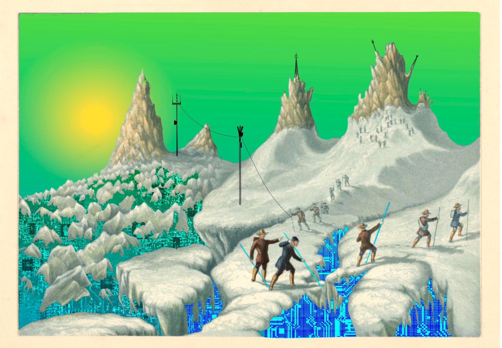

<blockquote style="padding: 1.5rem; background:transparent">
    

        
    

     
    
       <a href="www.hbarakat.com">Hanna Barakat </a> &amp; 
       <a href="https://aixdesign.co/posts/archival-images-of-ai">Archival Images of AI + AIxDESIGN</a> / 
       <a href="https://betterimagesofai.org/images?artist=HannaBarakat&title=DataMining3">Data Mining 3</a> / 
       <a href="https://creativecommons.org/licenses/by/4.0/">Licenced by CC-BY 4.0</a>
    
    

</blockquote>

## 전자-스팸 통

   정보가 과하게 넘실대는 세상에서 몸을 움츠리고 싶으면서도, 이 얇은 전자-스팸 통¹을 놓지 못하는 이유는 수집의 욕구 때문이다. 이 신비한 스팸 통에는 Shazam이라는 요정이 있어서, 버튼 하나만 누르면 지금 내 귀에 꽂힌 이 가락이 어느 곳에서 왔는지 알려준다. 공기에서 음악이 자취를 감추면, 귀에 콩나물을 끼우고, 그가 처음 나에게 다가왔던 순간을 복기한다. 소음과 단절되었을 때의 마음의 물결침이, 첫 파도와 그리 다르지 않다면 비로소 커다란 퍼즐에 작은 조각을 새겨넣는다. 절대로 완성되지 않을 ‘위대한 맞춤 음악’이라는 퍼즐의 한 부분을 채워넣는다. 사실 두 번째 파도가 허들을 넘기려면 기적이 필요하다. 가사의 허들도 있고, 리듬의 허들도 있고, 멜로디의 허들도 있고, 무엇보다 청자가 써내려가는 서사의 허들도 존재한다. 이 모두를 넘어야 한다. 하지만 수많은 허들의 높이, 즉 두 번째 울렁거림에 요구되는 역치란 사람마다 천차만별이라 ‘기적’이라 이야기하기에는 무리가 있을 수 있다. 품이 너무나 커서 수많은 음악을 껴안고 사는 사람이 있고 평생 몇 개의 가락만을 지니고 사는 사람이 있다. 그럼에도, 빈도의 차이가 있더라도, 우리는 수집하기를 주저하지 않는다. 그들을 듣고, 생각하고, 주머니에 고이 모셔 둔다. 그렇다면 어디서 주워야 할까. 어디서 귀를 부라리고 있어야만 이 일을 멈춰야 할 순간을 영원히 미뤄둘 수 있을까.

 

## 추천이 수집을 부추긴다

   어느 사람에게나 우연한 수집의 시간은 존재했었다. 음악이 어떻게 소비되고 있냐와는 조금 다른 차원의 이야기다. 말인즉슨, 음악에도 디깅(Digging)이라는 행위가 익숙해진 지금 /  ‘천 곡을 주머니 안에’ 혁신처럼 넣고 다녔던 시대 / 라디오에 옹기종기 귀를 맞대었던 시절 / 등등을 거슬러 올라가자는 이야기가 아니다. 부모님이 어떤 음악을 틀어 주었길래, 친구들이 어떤 멜로디에 그들의 푸르름을 맡겼길래, 이 드넓은 숲에서 퍼즐을 찾아 헤메이게 되었는가를 묻고 있는 것이다. 이 질문이야말로, 추천과 수집이 재귀의 늪에 빠진 지금, 우연이라는 초기 상태(Initial State)를 알아내려 하는 몸부림이다. 수집과 추천은 본래 느슨한 연결고리를 유지했었다. 기껏해야 좋아하는 아티스트의 앨범을 사 모으거나, 그와 협업한 사람의 음악을 듣는 수준이었다. 디스크자키의 취향이 자신의 취향이 되는 일도 있었다. 음악이 주머니 속으로 들어간 이후에도, 그것을 구매한다는 것이 “추천”의 자양분이 되지는 않았다. 줄세우기는 꽤나 오래 전부터 존재했으나, 그저 줄 세우는 대로 음악을 듣는 사람은 얼마 없었다. 그러나 지금은 수집이 추천을 촉진하며, 추천이 수집을 부추긴다. 그도 나를 모르고, 나도 그를 모르며, 나도 나를 잘 알지 못하지만, 그는 나에게 기꺼이 수집할 만한 음악을 들려준다. 이 필연의 순환이 몇 번 반복되고 나면, 수집은 디깅이 된다. 우리가 음악의 숲에서 하고 있는 일이, 최대한 많은 꽃의 이름을 알아 차리려 노력하는 게 아니라 나 보기에 예쁜 꽃들이 어디 모여 있나 눈을 치켜세우는 것이 된다. 

 

## 우연스럽게, 최초의 시간

  그렇다면, 나 보기에 역겨운 꽃들을 찾아 나서려면 어떻게 해야 할까. 사실 이 일은 순전히 당신의 선택에 달렸다. 구태여 궂은 생명들을 찾으려 비를 맞을 이유는 없다. 이 수집과 추천의 끝나지 않을 되먹임에서 잠시 눈을 돌리고 싶은 사람들만 발벗고 나서면 된다. 나도 그 중 하나일 뿐이다. 태초의 우연이 가물가물해, 확실한 기억으로 돌려놓고 싶은 사람 말이다. 이 지난한 여행을 떠나기 전에, 우리는 “좋아하는 음악을 듣는다”는 의식이 언제 처음 생겼는지를 알아야 한다. 이 어설픈 제안자가 어렴풋이 떠올린 기억은, 한 게임으로부터 출발한다. 닌텐도 DS 용으로 발매되었던 “도와줘, 리듬 히어로”라는 리듬 게임인데, 고사리 같은 손으로 매일매일 붙잡고 있었던 덕에 아직도 기억 저편에 남아있나 보다. 올드 팝의 박자에 맞추어 스타일러스 펜을 이리저리 움직이다 보면, 스테이지를 해결해 나갈 수 있었던 꽤나 단순한 형태였다. 하지만  나는 박자 감각이 예나 지금이나 썩 좋지 못한 편이라 (게임 전체를 따지고 볼 때) 쉬운 단계이었음에도 스테이지마다 시간을 많이 소모했었다. 그렇게 디스플레이에 격렬한 펜의 공격이 생채기를 낼 즈음, 음악은 처음으로 삶에 다가왔다. Avril Lavigne의 Sk8er Boi, Freddie Mercury의 I Was Born To Love You, Village People의 YMCA, Earth Wind & Fire의 September, Madonna의 Material Girl, Chicago의 You’re The Inspiration, David Bowie의 Let’s Dance까지… 마침 음악과 영화로 서로를 마주쳤던 나의 부모님은, 팝을 흥얼거리는 아들에게 얼씨구나 하며 영미 음악의 세계와 할리우드에 대해 알려주었다. 나이에 맞지 않게(?) 배철수의 음악캠프를 듣기 시작한 때도 이 즈음이었다. 그렇다. 바로 그곳이다. 나에게 아직 ‘음악 기술’의 간섭이 없었던 시간, 인간과 기계가 다른 어떤 곳보다도 빠르게 상호작용하는 그곳에서 나는 수집을 배웠다.

 

## 짧고 거친 모험

   최초의 상태를 찾았다. 그렇다면 다음에는 무엇을 해야 하는가. 그건 바로 다른 사람의 ‘최초 상태’를 수집하는 것이다. 이 최초 상태는 아직까지도 0과 1로 환원할 수 없는 거의 유일한 이야기다. 대부분의 스트리밍 서비스는 처음 계정을 생성할 때 우리에게 “이미 좋아하는 아티스트나 장르”를 묻는다. 이 비트의 때가 묻지 않은 이야기가 있어야만, 저 끝없어 보이는 되먹임도 시작할 수 있는 것이다. 비슷한 자리를 맴도는 디깅에서 벗어나 모험을 떠나려면 사람들의 이야기를 수집해야 한다. 이야기나 음악 기술이 결부되지 않은 음악은 나에게 ‘역겨운 음’의 집합에 지날 공산이 크다. 타인 뿐 아니라 자신의 태초부터 새로이 이야기를 써 나가도 좋다. 흘러간 옛 가수의 새 앨범을 듣는다든지, 영화 OST로 삽입된 사실을 이제서야 알아챈다든지, 관련된 음악의 ‘전문 채널’을 찾아 나선다든지, 그렇게 다시 시작하는 일도 모험이다. 그렇게 때 묻지 않은 취향을 찾아 떠나보면, 당신은 오랜만에 디깅의 숲 바깥에서 퍼즐을 수집하게 될 것이다. 이미 음악 ‘기술’과 ‘나’는 - 서로를 모르더라도 - 훌륭한 공생 관계를 갖추고 있었다. 그에게서 떠나오는 길이 마냥 밝은 전망만을 지니고 있지는 않으나.. 그는 내가 없어도 충분히 잘 먹고 잘 살 것이다. 돌아가기 어려운 것도 아니며, 그들은 항상 반겨 줄 터이니, 우리는 가끔 이 짧고 거친 모험을 즐기면 된다. 

 

   <blockquote>
      ¹ 스팸 통조림의 크기를 조금 키운 다음, 얇은 두께로 자르면 iPhone 16 비슷한 모양이 된다.
   </blockquote>