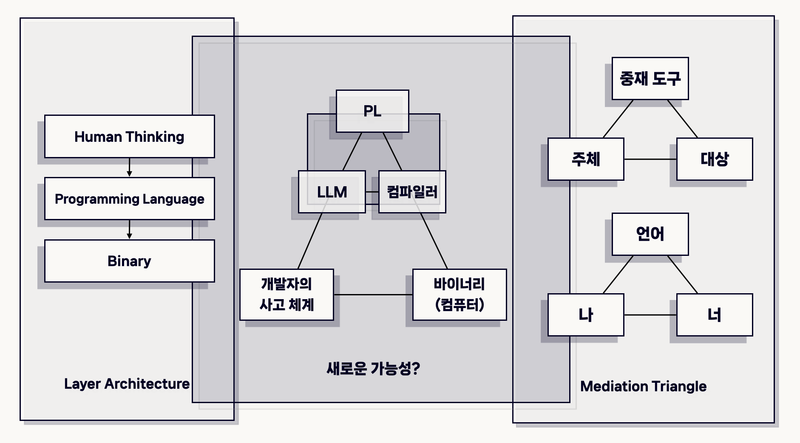

<blockquote style="padding: 1.5rem; background:transparent">
     
    <a href="https://betterimagesofai.org/whoWeAre">Deborah Lupton</a> / <a href="https://betterimagesofai.org/images?artist=DeborahLupton&title=ServersinaLandscape">Servers in a Landscape</a> / <a href="https://creativecommons.org/licenses/by/4.0/">Licenced by CC-BY 4.0</a>
</blockquote>

## 들어가기: CS에서 언어를 공부하게 된 이유

<blockquote style="padding: 1.5rem; background: transparent;">

 실천하기(<i>여기서는 AI가 우리로 하여금 무엇을 할 수 있게 만드는가에 대한 의미</i> )의 측면에서 리터러시와 관련해 가장 주목할 만한 사건은 이제 인간이 자신의 언어, 즉 자연어로 기계와 상호작용하기 시작했다는 것입니다.  
오랜 시간 컴퓨터는 0과 1의 이진법 체계로 된 신호만을 처리할 수 있었고   이 같은 특성에 맞추어 적절히 소통하려면 프로그래밍 언어를 사용해야 했지만 
자연어 처리의 발전으로 인간의 언어를 서서히 <strong>'이해'</strong>하게 되었습니다.  
거대언어모델 등 인공지능의 첨단 기술이 상용화되면서 인간은 자신의 언어로 디지털 기기와 소통할 수 있는 길을 열었습니다.  
이제 비전문가들도 논리적 흐름을 알고 있다면 엑셀 같은 스프레드시트의 함수나 간단한 코드 작성을 어렵지 않게 할 수 있습니다.  
몇 가지 원리를 학습하고 나면 프로그래밍을 모르는 사람도 프롬프트를 통해 코드를 생성할 수 있습니다. <i>(중략)</i>   
해당 분야에서 오랜 경험을 쌓은 전문가들이 해낼 수 있는 것과는 비교가 되지 않겠지만, 
예전에는 넘볼 수 없었던 과업을 일상의 언어로 수행할 수 있다는 것은 프로그래밍을 둘러싼 리터러시의 지형을 흔들어 놓기에 충분합니다.

<h6>김성우, ⌜인공지능은 나의 읽기-쓰기를 어떻게 바꿀까⌟, 유유, 2024, pp.339-340 </h6>
</blockquote>

 

언어는 공기 다음가는 제일-매체이자, 사람들 사이의 최고-중재자(mediator)입니다. 우리는 이 엄격하고도 모호한 규칙을 때로는 암묵적으로, 때로는 새하얀 종이에 새까만 흔적을 남기는 방식처럼 명징하게 드러냅니다. 하지만 인간이 어떻게 이 위대한 규칙 - 즉 언어를 사용하게 되었는지는 수수께끼의 영역입니다. 문자마저 그 기원을 명확하게 파악할 수 있는 케이스가 단 하나 존재하는데, 지금 여러분과 제가 **중재자**로 사용하는 '한글'이 바로 그것입니다. 

우리가 일상에서 발화하는 '언어'와 달리, 프로그래밍 언어는 컴퓨터와 프로그래머 모두를 <strong>이해</strong>하는 중재자라기 보다는, 하위 계층(Low-Level Language)과의 엄격한 커뮤니케이션 규칙을 따르는 추상화 계층으로 취급되어 왔습니다. 천공 카드(punched card)와 어셈블리는 고도화되는 소프트웨어를 개발하는 데 큰 장애물이었기 때문에, 1972년 C가 탄생한 이래 수많은 언어들은 엔지니어들의 필요에 부합하는 추상화를 수행했습니다. 

폰-노이만 컴퓨터는 기본적으로 결정론적 기계이므로, 추상화된 기술(Description)도 결정론에 입각해야만 합니다. 다시 말해 정제된 의도를 가지고, 미리 제공된 논리식에 충실한 입력만이 비로소 하위 계층이 가진 형태로 캡슐화(Encapsulation)될 수 있는 것입니다. 여기서 상위 계층의 표현을 하위 계층의 표현으로 옮기는 일을 수행하는 기계(Finite State Machine)를 컴파일러라고 부릅니다. (물론 컴파일러를 단순히 FSM이라고 명명할 수 있지는 않습니다. 이에 대한 내용은 [컴파일러를 납작하게 만들기 부분](./#컴파일러를-납작하게-만들기)에서 자세하게 다룹니다.)

    

<blockquote style="padding: 1.5rem; background:transparent">
    <strong>Diagram 1</strong>  

    <strong>왼쪽</strong> : LLM이 등장하기 이전의 세계관  
    <strong>오른쪽</strong> : 인간 사이의 커뮤니케이션을 '중재' 개념으로 바라보았을 때 그려지는 구조도  
    <strong>가운데</strong> : LLM이 등장한 이후, 개발자 - 프로그래밍 언어 - 바이너리 사이에서 그려지는 새로운 관계 구성
</blockquote>

 

어느새 시간은 흘러, 천공 카드 => 어셈블리 => 포트란 => C => 이외의 수많은 언어의 탄생을 목격한 우리는, 자연어로 기계와 소통할 수 있는 시대를 맞이했습니다. 자신들이 만든 훌륭한 '추상화 도구'를 통해, 개발자들은 더 이상 코드를 작성하지 않을 수 있을지도 모릅니다. 자연어는 이제 확률론적 기계를 통과해, 프로그래밍 언어의 규칙을 충실히 따른 형식 언어로 변환됩니다. 여기서 의아한 부분은, 암묵지를 필연적으로 수반하는 자연어가 확률론적 기계로 투입되는데, 그 결과는 형식 언어라는 것입니다. 그리고 결과로 도출된 형식 언어는 곧장 결정론적 기계 (컴파일러)로 흘러들어가 0과 1이 될 준비를 마칩니다. 

물론 우리가 트랜스포머 모델에 투입하는 문자들은, 일상의 문자들에 비해 상당히 [정제되어 있을 가능성](https://code.claude.com/docs/ko/skills)이 높습니다. 하지만 LLM이 같은 입력에 대해 같은 출력을 보장하는 기계가 아니라는 점은 여러 가지 시사점을 남깁니다. 여러분의 머릿속에 떠오르는 모든 질문이 정답입니다. 저에게 떠오른 질문은, 더 이상 '프로그래밍 행위와 컴파일'를 계층적인 접근(Diagram 1의 왼쪽)으로만 바라볼 수 있는가입니다. 또한 <i>- 개발자들 사이에서 우스갯소리로 이야기하는 -</i> '자연어 컴파일러'라는 것이 가능한지, 즉 거대 언어 모델을 컴파일러로 명명할 수 있는 시대가 도래할 수 있는가에 대한 질문을 던져볼 수도 있습니다.

이 글에서 최초의 언어 사용에 대해 논증하는 수많은 가설들을 프로그래밍 언어의 시작과 연결하지는 않을 겁니다. 대신 러시아의 발달심리학자 레프 비고츠키의 중재(mediation) 개념을 빌려, 프로그래밍 언어를 기존의 '추상화 계층'으로 바라봄과 동시에 '중재자'로서도 규정하려 합니다. 그리고 사람과 사람 사이에서만 중재자로 활동하던 우리의 '언어'가 기계와 인간 사이에 위치하게 되면서, 비트 세계의 **중재자**인 컴파일러와 프로그래밍 언어(이하 PL)의 역할이 변화할 가능성에 대해 조명합니다. (Diagram 1의 오른쪽) 그러한 변화에 힘입어, 새롭게 떠오른 여러 질문들의 기저를 이루는 명제들을 톺아봅니다. 

- 거대 언어 모델(이하 LLM)이 컴파일러가 되려면, 컴파일러-인간 모두에 무엇을 전제해 두어야 할까요?
- 컴파일러를 컴파일러라고 부를 수 있는 조건은 무엇일까요?
- 자연어와 형식 언어가 갈라지는 지점은 어디일까요?
- 개발자가 '코드를 작성하는 논리적 기계이자 의도를 가진 주체'에서 온전히 '자연어 입력 장치'로 환원될 경우 생각해 볼 수 있는 문제는 무엇이 있을까요?

 

### 코드를 쓰는 일과 문자를 사용하는 일은 같은 행위인가

[열기] 프로그래밍 언어를 처음 배울 때, 우리는 그것을 언어라고 배우는가, 아니면 도구라고 배우는가?  

[심문] Chomsky의 형식 언어 이론은 자연어와 프로그래밍 언어를 같은 분류 체계(Type 0~3) 안에 놓는다. 이 분류는 두 언어가 같은 종류임을 증명하는가, 아니면 같은 기술 방식으로 기술될 수 있음을 보여주는 것에 불과한가?

### 이해하는 기계, 분류하는 기계

[열기] 컴파일러 수업에서 처음으로 Lexer와 Parser를 구현했을 때, 그것이 언어를 이해하는 기계처럼 느껴졌는가, 아니면 문자열을 분류하는 기계처럼 느껴졌는가?  

[남기기] LLM이 등장했을 때, 그것이 코드를 생성하는 것을 보고 든 첫 번째 질문은 무엇이었는가 — "어떻게 가능한가"인가, 아니면 "이것을 컴파일러라고 불러도 되는가"인가?

 

## 트랜스포머를 컴파일러로 명명하려면

### 기능할 수 있다는 것과 정의된다는 것

**1. 명명은 기술(description)인가, 결정(decision)인가**

[열기] "LLM as a Compiler"라는 표현이 학술 논문의 제목에 등장할 때, 그것은 LLM이 컴파일러처럼 기능함을 서술하는가, 아니면 LLM을 컴파일러로 정의하자는 제안인가?  

[심문] Zhang et al.(2025)은 LLM을 컴파일러로 사용하는 것을 "패러다임 전환(paradigm shift)"으로 명명한다. 패러다임 전환은 기존 개념의 확장인가, 아니면 기존 개념의 해체인가? 컴파일러라는 개념이 해체된다면, 우리는 무엇을 잃는가?

### 우리가 동의해야 하는 명제들

**2. 호명 행위가 요구하는 세 가지 전제의 예고**

[열기] LLM을 컴파일러라고 부르기 위해 우리가 이미 동의했어야 하는 것들은 무엇인가?  

[심문] Shuoming Zhang et al.(2026)의 서베이는 LLM의 역할을 Selector, Translator, Generator로 분류한다. 이 세 역할이 하나의 이름 — "컴파일러" — 을 공유할 수 있다면, 그 이름은 무엇을 의미하는가? 그리고 이 분류 자체가 단일한 호명이 불가능함을 방증하지 않는가?

[남기기] 이 글은 그 세 가지 전제를 하나씩 열어보는 시도다 — 컴파일러에 대한 전제, 언어에 대한 전제, 인간에 대한 전제.

 

## 컴파일러를 납작하게 만들기

LLM을 컴파일러로 환원하려면, 컴파일러를 단지 번역 기계, 소스에서 타겟으로 변환하는 기능으로만 그 역할을 한정해야 한다.

**1. 컴파일러는 번역기인가**

[열기] 컴파일러를 translator라고 부를 때 우리는 무엇을 번역한다고 생각하는가 — 문법인가, 의미인가, 아니면 의도인가?  

[심문] Lexer는 문자열을 Token으로 분해하는 기계다. Parser는 Token의 나열에서 구조를 추출하는 기계다. Semantic Analyzer는 그 구조에서 의미를 검증하는 기계다. 이 세 기계는 서로 다른 종류의 작업을 수행하는가, 아니면 같은 작업의 다른 단계인가?  

[심문] LL/LR/LALR Parsing이 모든 Context-Free Grammar를 커버하지 못하는 경우가 있다는 사실은, Parsing이 언어의 규칙을 따르는 행위가 아니라 언어의 규칙을 특정 메커니즘으로 환원하는 행위임을 보여준다. 이 환원이 실패할 때, 실패한 것은 언어인가 메커니즘인가?  

**2. 최적화는 번역의 일부인가**

[열기] LLVM의 -O0에서 -O3로 올라가는 최적화 단계는, 더 좋은 번역을 수행하는가, 아니면 번역과는 다른 종류의 작업을 추가로 수행하는가?  

[심문] Romero Rosas et al.(2025)의 실험에서 PLUTO는 폴리헤드럴 모델 전문화를 통해 특정 벤치마크에서 7x speedup을 달성했다. 이것은 더 좋은 번역인가, 아니면 번역이라는 범주 밖에 있는 무언가인가? 최적화를 번역의 일부로 포함시킬 때, 컴파일러의 정의는 어디까지 확장될 수 있는가?  

**3. 납작해진 컴파일러가 LLM을 위해 무언가를 양도한다**

[심문] Zhang et al.(2025)이 LLM as Compiler의 장점으로 제시하는 것 중 하나는 "중간 변환 과정에서 발생하는 정보 손실의 제거"다. 그런데 Frontend → Middle-end → Backend를 거치는 과정에서 발생하는 정보 손실은, 손실인가 아니면 의도적 추상화인가? 모든 정보를 보존하는 번역기가 더 나은 컴파일러인가?  

[남기기] 컴파일러를 납작하게 만드는 행위는 컴파일러의 어떤 기능들을 보이지 않게 만드는가 — 그리고 그 기능들은 자연어로 명세될 수 있는가?

 

## 자연어를 파싱 가능한 것으로 환원하기

자연어와 형식 언어를 같은 선상에 놓을 수 있는가? 과연 자연어를 평면화할 수 있는가?

**1. 수화는 음성 언어의 번역인가**

[열기] <코다>에서 루비의 가족이 사용하는 ASL(미국 수화)은 영어를 수어로 번역한 것인가, 아니면 독립적인 언어 체계인가? 두 언어가 같은 의미를 가리킬 수 있다는 사실이, 두 언어를 같은 종류의 언어로 만드는가?  

[심문] 프로그래밍 언어는 형식 의미론(formal semantics)을 갖는다 — 프로그램의 의미는 실행 결과로 검증될 수 있다. 자연어는 화용론적 의미(pragmatic meaning)를 갖는다 — 발화의 의미는 맥락, 의도, 화자-청자 관계에 따라 달라진다. 이 두 종류의 의미가 LLM 안에서 매핑될 때, LLM은 무엇을 보존하고 무엇을 버리는가? 

**2. 프롬프트는 소스 코드인가**

[열기] <드라이브 마이 카>에서 다국어 배우들이 체호프의 텍스트를 각자의 언어로 수행할 때, 공유되는 것은 텍스트인가 침묵인가? 말해지지 않은 것들의 무게가 번역될 수 있는가?  

[심문] Romero Rosas et al.(2025)에서 DIP(Detailed Instruction Prompting)가 단순 지시보다 일관되게 우수한 성능을 보인 것은, 프롬프트에 명시적인 컴파일러 전략 — 즉 형식화된 지식 — 이 포함되었기 때문이다. 자연어가 형식 언어에 가까워질수록 LLM이 더 잘 "컴파일"한다면, 진짜 파싱 작업은 LLM이 수행하는가, 아니면 프롬프트를 작성하는 인간이 수행하는가?  

[심문] 프롬프트가 파싱 가능하려면, 프롬프트는 모호하지 않아야 한다. 그런데 자연어의 표현력은 모호성을 통해 확장된다 — 시, 은유, 역설이 그 예다. LLM을 컴파일러로 사용하는 것은 자연어에서 모호성을 제거하는 방향으로 자연어를 훈련시키는 일인가?

**3. 파싱 가능성의 지평**

[심문] 컴파일러의 Parsing이 Context-Free Grammar의 범위 안에서만 작동하듯, LLM의 "파싱"도 특정 분포의 텍스트 안에서만 안정적으로 작동한다. 이 한계는 같은 종류의 한계인가, 아니면 근본적으로 다른 종류의 한계인가?  

[남기기] 자연어를 파싱 가능한 것으로 환원할 때, 우리는 자연어 화자인 인간에 대해 무엇을 가정하는가?

 

## 인간을 입력 장치로 만들기

인간의 발화가 Parsing 가능한, 기계의 입력으로 기능할 수 있는가?

**1. 추상화 계층의 역사와 그것이 숨긴 것들**

[열기] Assembly에서 C로, C에서 Python으로 추상화 계층이 올라오면서, 프로그래머는 하드웨어로부터 멀어졌다. 이 거리는 자유인가 손실인가 — 아니면 그 구분이 의미 없는 질문인가?  

[심문] 각 추상화 계층의 상승은 표현해야 할 것의 범위를 좁혔다. C 프로그래머는 레지스터를 명시적으로 관리하지 않아도 된다. Python 프로그래머는 메모리를 직접 할당하지 않아도 된다. 자연어 계층에서는 무엇을 명시적으로 표현하지 않아도 되는가 — 그리고 그 "않아도 됨"이 무엇을 은폐하는가?

**2. 프로그래머의 위치 이동**

[열기] LLM이 코드를 생성하기 이전에, 프로그래머는 소스 코드를 직접 작성하는 자였다. LLM이 코드를 생성한 이후, 프로그래머는 자연어로 의도를 기술하는 자가 된다. 이 위치 이동은 프로그래머를 해방시키는가, 아니면 프로그래머를 컴파일 파이프라인의 일부로 편입시키는가?  

[심문] Romero Rosas et al.(2025)의 실험에서 LLM은 약 20줄 이하의 코드에서만 신뢰 가능한 결과를 냈다. 실제 소프트웨어가 수천, 수만 줄로 이루어진 현실에서, 이 한계를 보완하기 위해 인간이 개입하는 방식은 어떠한가 — 그리고 그 개입 방식은 인간을 LLM의 검증 도구로 만드는가?  

**3. 사이버네틱스적 귀결 또는 그것에 대한 저항**

[심문] Wiener의 사이버네틱스는 인간과 기계를 피드백 루프로 연결된 정보 처리 시스템으로 기술했다. 이것은 인간을 기계로 환원한 것인가, 아니면 기계의 범주를 인간을 포함하도록 확장한 것인가? 이 두 해석은 실질적으로 다른 귀결을 낳는가?  

[남기기] 인간이 LLM의 입력 장치가 된다는 것이 비판받아야 할 이유는 무엇인가 — 그리고 그 비판이 가능하려면, 인간을 입력 장치가 아닌 무언가로 규정할 수 있어야 한다. 그것이 가능한가?  

 

## 나가기: 추상화는 자연스러운 흐름인가

### '자연스러움'의 정치학

[열기] 추상화가 "자연스러운 흐름"이라는 주장은 누구의 자연스러움인가 — 그 흐름에서 이익을 얻는 자의 자연스러움인가, 아니면 그 흐름 안에서 위치가 이동되는 자의 자연스러움인가?  

[심문] Assembly에서 고수준 언어로의 추상화는 더 많은 사람이 프로그래밍에 접근할 수 있게 했다. 자연어로의 추상화도 같은 방향의 연장인가? 아니면, 이전 추상화들이 프로그래밍 언어라는 형식성을 유지했다는 점에서, 자연어로의 이행은 질적으로 다른 단계인가?

### 인간이 꿈꾸어야 하는 것

[심문] Dick의 원문에서 안드로이드가 전기 양을 꿈꾼다는 것은, 기계가 유기체적인 것을 욕망한다는 의미다. "Does a LLM dream of compilers?"라는 질문을 반전시키면 — 컴파일러는 LLM을 꿈꾸는가? 결정론적 기계가 확률론적 기계를 욕망한다는 것은 무엇을 의미하는가?  

[남기기] LLM을 컴파일러로 호명하는 행위가 컴파일러와 인간 모두에 대해 특정한 세계관을 선택하는 것이라면, 우리는 그 선택을 의식적으로 수행하고 있는가 — 아니면 이미 그 선택 안에 들어와 있는가?

 