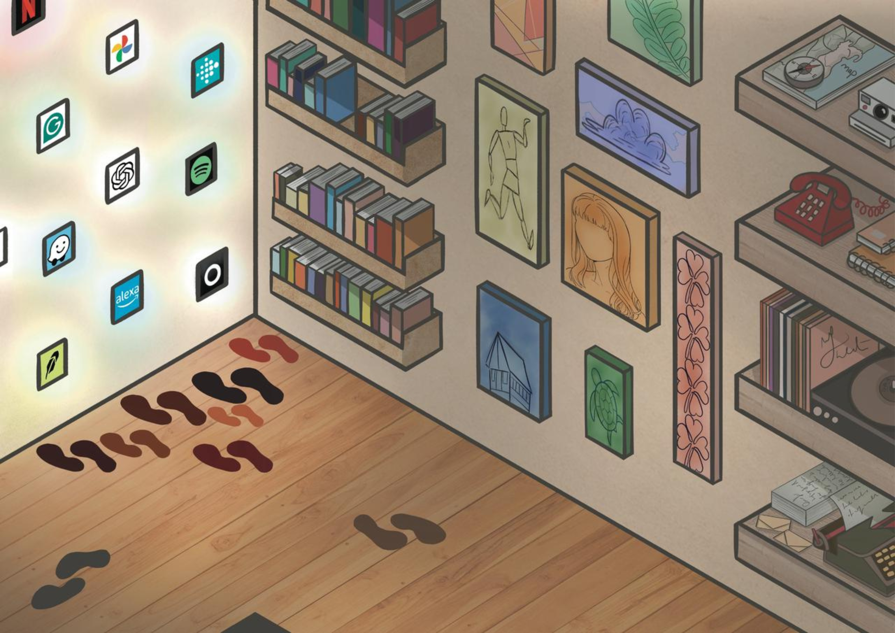
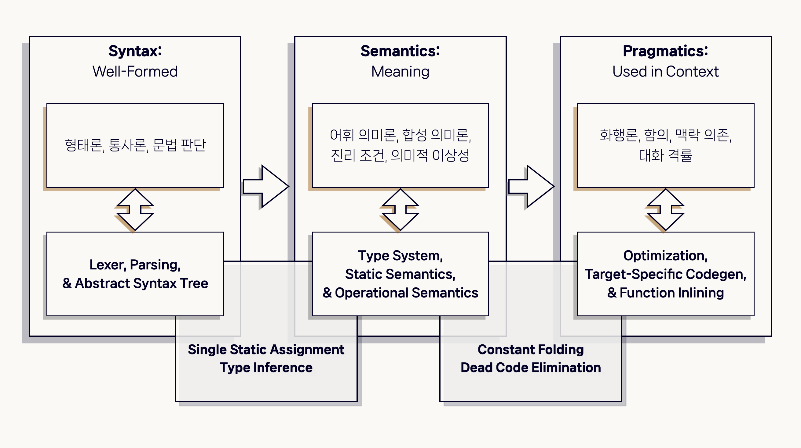
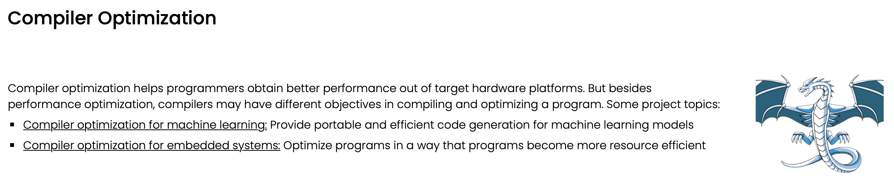

<blockquote style="padding: 1.5rem; background:transparent">
     

     <a href="https://reihanehgolpa.github.io/">Reihaneh Golpayegani</a> &amp; <a href="https://www.adaptcentre.ie/discussai/bigger-picture/">The Bigger Picture</a> / <a href="https://betterimagesofai.org/images?artist=ReihanehGolpayegani&title=ACornerOfTheHistory">A Corner Of The History</a> / <a href="https://creativecommons.org/licenses/by/4.0/">Licenced by CC-BY 4.0</a>
</blockquote>

## 들어가기 : 나는 저기 숲이 되어 볼래

<blockquote style="padding: 1.5rem; background:transparent">
    주체를 상호주체성으로 언급해야 하는 이유는 당신의 삶이 살 만하지 않고서는,  그리고 수많은 삶이 살 만하지 않고서는 나의 삶도 살 만하지 않기 때문입니다.
    

    <h6>주디스 버틀러 그리고 프레데리크 보름스, ⌜살 만한 삶과 살 만하지 않은 삶(The Liveable and the Unlivable)⌟(2023), 문학과지성사, 2024, p. 59</h6>
</blockquote>

 

숲이 되고 싶었던 이유는 당신의 삶을 품고 싶어서였다. 당신의 삶에 모험을 불어넣고 싶어서, 그럼으로써 나의 삶이 생기를 되찾기를 바랐다. 나무만을 바라본다는 뼈아픈 핀잔을 돌파하고 싶었다. 하나를 너무 사랑해서 다른 것들을 사랑하지 못한다는 질책을 피하고 싶었다. 나무 한 그루가 아니라, 숲이 되어 수많은 가지에 깃들면, 누구라도 나를 보아주겠지 하며 마음을 태웠다. 하지만 마음을 태웠더니 남는 건 재가 아니라 물이었다. 염기를 가득 머금은 물. 이미 있는 나무에도 별 도움을 주지 않는 그런 물 말이다. 숲에 어울릴 만한 상태가 아니었다. 그렇게 나는 숲이 아니라 바다가 되었다. 너무나 잔잔해서 서퍼들조차 눈길을 주지 않는 그런 바다. 깜빡하고 떠보니, 내 눈 밑에는 우물이 강물이 되어 바다로 흘러간 흔적이 보였다. 아, 나는 나무조차 되지 못했다. 물을 굽이굽이 돌려 낼 언덕조차 나에게는 없었다. 끝없이 흘려내었다. 그렇게 세찬 물길에 닳고 닳은 몸은 바다 밑으로 가라앉았다.

 

그러므로 이 글은 숲이 되려다가 물이 되어 바다로 흘러간 사람의 이야기다. 무엇 하나 제대로 챙기지 못하고 손끝마다 아쉬워하다 이제야 정신을 부여잡고 텍스트로써 그 시간들을 복기하려는 미약한 손놀림의 발로이다. 나는 무엇을 사랑했고, 무엇을 사갈시했으며, 무엇을 끝내 놓지 않았나. 내 전공은 나에게 어떤 의미였고, 나는 그것을 삶에 어떻게 녹이려 했나. 그리고 텍스트는 나를 어떻게 드러내었나. 단 하루도 톺아보지 않았던 사람이 감히 일 년을 되짚어 보려 한다. 근시안적일 수도, 깊다 못해 심연으로 빠질 수도, 방향타를 놓쳐 표류할 수도 있으나, 꼿꼿이 한 해를 붙잡아 보려 한다. 무모하게도 삶과 글쓴이 자신을 분리해 보고자 한다. 둘 모두를 양팔 저울에 올려두고, 추를 이쪽에 두었다 저쪽에 두었다 하려 한다. 그러나 글쓴이에게 망각은 만연한 일이며 그 망각은 한없이 철없다. 그러니 부디 따뜻한 성정을 옆에 두고 이 글을 읽어 주기를. 자신의 삶과는 다른 모양의 삶에 잠시 귀 기울여 주기를.

## 컴파일러와의 조우

    

<blockquote style="padding: 1.5rem; background:transparent">
    <a href="https://www.instagram.com/idunayu/?igshid=Njh0aHU1OTJtdzJ3&utm_source=qr">Yutong Liu</a> &amp; <a href="https://www.kingston.ac.uk/faculties/kingston-school-of-art/">Kingston School of Art </a> / <a href="https://betterimagesofai.org/images?artist=YutongLiu&title=TalkingtoAI2.0">Talking to AI 2.0</a> / <a href="https://creativecommons.org/licenses/by/4.0/">Licenced by CC-BY 4.0</a>
    

    <i>비트의 세계를 조작하는 일. 나의 알고리즘이 위성에도 사용된다니.
    너무나 멋있어 보였다.</i>  
</blockquote>

### 공부하고 싶어요

재밌는 일을 찾아야 했다. 사실 재밌는 일은 저절로 찾아오는 줄만 알았다. 어린 시절엔 발길에 차이는 것이 '재밌는 일'이었다. 하지만 그 시절의 영재성이란 빠르게 자취를 감추는 종류의 무엇이었다. 우리는 저마다의 방식으로 스스로의 영재성을 지워낸다. 기대에 자신을 맞춰내는 사람들이 있고, 수용소에서 스스로를 무참히 빨래하는 사람들이 있고, 섣부른 확신이 존재한 적 없었던 삶의 브랜치(Branch)를 사라지게 하는 경우도 있다. 영재성이 그 무지개 색을 잃고 바래기 시작하면, 존재한다는 이유만으로 재미있었던 일들은 우리의 눈가를 떠난다. 그 시간이 도래한 이후부터, 재미있는 일을 찾는 건 고통을 수반하는 일이 된다. 기대와, 빨래와, 섣부른 확신이 우리에게 편견을 주기 때문이다. 내 몸 밖에 있는 걸 바라보는 데 있어 편견을 가지는 것만큼 고통스러운 일은 없다. 나의 세계, 내가 포함되지 않은 관계에서 비롯된 이를 내 세계에 맞추려 하는 것만큼 어리석은 일은 없다. 편견은 그 존재하지 않는 가능성을 눈 앞에 비춘다. 편견은 있는 그대로의 포용을 불가능하게 만든다. 영재성은 상대방을 정제하지 않고 내 몸을 타고 흐르도록 하는 능력이다. 편견이 있다면 영재성은 쉬이 지워진다. 

<blockquote style="padding: 1.5rem; background:transparent">
다시 말하자면 어떤 인위적이거나 의도적인 거짓말이 대상과 아이 사이에서 작동하지 않는다는 거예요.   사실 모든 거짓말의 선입견을 빼버리면 누구나 영재성이 드러날 거예요.  
우리가 지적 능력이 모자란다, 감성적 능력이 모자란다 하는 것은 대상과 나 사이에 직접적인 관계를 훼손시키는, 그것을 목적주의적으로 다른 것으로 바꾸려 하는 방해 요소들 때문에 그래요.  
우리가 무의도적이 되면 얼마나 많은 것을 느낄 것이며, 얼마나 놀라운 지적 통찰이 이루어질 것인가 생각해 보세요.

<h6>김진영, ⌜상처로 숨 쉬는 법⌟, 한겨레출판, 2021, pp. 596-598</h6>
</blockquote>

 

그런데 나는 더 이상 아이가 아니었다. 거짓말은 수두룩하게 저질러 왔고 전공마저 스스로를 현실에 맞게 타이른 결과였다. 재미있는 일을 찾는 건 이미 고통일 수밖에는 없었다. 하지만 슬픈 어른으로 남기에는 남아 있는 나날들이 너무 길었다. 열렬한 국가 방위의 사명을 몸 속에서 덜어내기에도, 주어진 삶의 역겨움을 드러내기에도 너무나 어렸다. 내게 주어진 삶을 사랑해야지. 비트로 이루어진 인간들과 이 기계를 갈망해야지. 일단 앞에 놓여진 것으로부터 상상을 시작해야 했다. 주어진 게 있었다. 일상처럼 사용하는 언어를 가지고 노는 일이 그것이다. 

<strong>아톰 세계에서 20년 넘게 사용한 언어, 그리고 아톰을 비트 세계로 이식하는 데 사용되는 언어.</strong> 아톰 세계의 언어에게 학문이 존재하듯이 컴퓨터과학(Computer Science, CS)의 세계에서 사용되는 언어에게도 학술의 언어로 구조화될 권리가 존재한다. 그 권리를 주창한 CS의 세부 분야에는 컴파일러와 PL(Programming Language Theory)이 있는데, 언어학의 통사론(Syntax) / 의미론 (Semantics) / 화용론 (Pragmatics)와 대응되는 개념들이 두 부분집합의 영역에 포진되어 있다. 언어학과 CS의 두 분야를 연결해 보는 과감한(?) 시도는 글쓴이의 원대한 목표이므로 여기선 장황하게 펼쳐놓지 못하겠지만, 아래의 다이어그램과 같이 간략하게는 정리해 볼 수 있겠다. 

    

<blockquote style="padding: 1.5rem; background:transparent">
    컴파일러는 사람의 언어에 <i>가까운</i> 형태의 표현을 다른 규칙의 표현으로 변환하는 일을 수행한다.  
    여기서 '<strong>다른 규칙의 표현</strong>'이란 0과 1의 나열이 될 수도 있고 / 특정 CPU (중앙처리장치)만 알아듣는 표현일 수도 있고 / 아니면 (사람이 알아보기에) 비슷한 수준의 다른 규칙을 가진 것일 수도 있다.  
    가장 널리 사용되는 형태의 컴파일러는 범용 표현을 특정한 기계의 맥락에서만 활용 가능한 표현으로 변환하는 일련의 과정 전체를 포괄하는 기능을 수행한다.  
    즉 프로그래머가 작성한 코드의 문법 / 의미 / 맥락을 분석하여 최적의 실행 시간을 지닌 기계어의 집합을 만들어내는 기계인 것이다.

    위의 풀이는 - 풀어 써놓았음에도 - 너무 어려우니, 우리가 사용하는 언어를 생각해 보자. 간단한 문장이 아래에 있다.
    <blockquote style="padding: 1.5rem; background:transparent">
        나는 당신을 사랑해.
    </blockquote>
    이 문장을 네트워크 명령어로 변환하는 컴파일러가 있다. 위의 구문은 다음과 같은 동작을 수행해야 한다.
    <blockquote style="padding: 1.5rem; background: transparent">
        <code class="language-text"><strong> 나(Client) -- 사랑(Request) --> 당신(Server) </strong></code>  
        <code class="language-text" style="color: rgba(148, 82, 0, 1)"><strong> 나(행위자) -- 사랑(행위) --> 당신(행위의 대상) </strong></code>
    </blockquote>
    CS를 전공한 사람이라면 언제든 되새기는 사실이지만, 컴퓨터는 멍청하다.  
    컴퓨터에게 누가 행위자인지(Client), 누가 행위의 대상인지(Server)인지, 행위자가 어떤 행위를 수행하는지(Request) 알려주려면, 해석 규칙을 꼼꼼하게 작성해야 한다. 먼저 철자를 확인하기 위한 방식부터 마련해 보자.  
      
    <image src="./images/lexing.png" />  
    위와 같은 단계에서 "해랑사 을신당는 나"와 같은 문장은 걸러진다. 단순히 생각해서, '해'라는 문자로 시작하는 예약어는 없기 때문이다. 
</blockquote>

 

처음으로 선택한 언어는 <code class="language-text" ><a href="../kotlin_conf23" style="color: orange"><strong>Kotlin</strong></a></code>이었다. 

### 연구하고 싶어요

    

<blockquote style="padding: 1.5rem; background:transparent">
    Research Area : <a href="https://coslab.khu.ac.kr/research#h.q8l36756ne35"><strong>Compiler Optimization for embedded systems</strong></a>
    

    사실 오픈소스 컴파일러를 바닥부터 뜯어고치겠다는 야심찬 포부(?)는 아카데미에서 펼치기에는 무리인 감이 없지 않았다. 결국 글쓴이는 FPGA라는 걸 들여다 보게 되는데...
</blockquote>

 

뜯어보니 Kotlin은 끝없이 덧칠된 언어였다. 각양각색의 설탕으로 뒤덮인 언어. 

### 논문쓰기 싫어요 (?)

## 최전선의 기술에게 윤리를 요구하는 법

### "기술은 우리를 구원하지 않는다"

<blockquote style="padding: 1.5rem; background:transparent">
    인간의 동물화는 영화 속 이야기¹만이 아닙니다.  
하루에 몇 시간씩 핸드폰 화면만 바라보고, 누가 더 많이 먹고 어디가 맛집인지 등 온통 먹는 것에만 관심을 기울이며,  모니터 위의 영상만으로 (알고리즘의 인도만으로) 세계의 우연성과 복잡성을 손쉽게 대체해 버리는 지금-여기의 우리 이야기이기도 하죠.   질문은 영화에서 현실로 곧장 안착합니다. 우리는 어떻게 세계의 우연과 마주칠 수 있을까요?  처음부터 인간으로 태어나는 게 아니라면, 우리는 어떻게 인간이 될 수 있을까요?   우리가 지금 써 내려가는 역사는, 정말 이전보다 조금이라도 더 나은 역사일까요?  
우리는 인간인 우리 자신을 극복할 수 있을까요?  우리는 어떻게 비인간 존재들과 공생하면서 이 세계를 더 나은 세계로 만들어 갈 수 있을까요?

  
박승일, ⌜기술은 우리를 구원하지 않는다⌟, 사월의책,  2025, p.377  
¹ 여기서는 2008년 개봉한 픽사 스튜디오의 애니메이션 〈월-E〉를 지칭합니다.
</blockquote>

 

픽사 애니메이션 스튜디오의 <월-E>에서는 모든 행위와 욕구를 '최첨단 의자'에 의존한 채 연명하는 인간의 모습을 다룬다. 반면 우리의 로봇 주인공 '월-E'는 -비록 지구에 혼자 남겨져 쓰레기를 정리하는 단순한 일을 반복하고 있다 하더라도- 더욱 인간다운 삶을 영위하고 있다. 얼마나 오염되었을지 모르는 땅에서 작은 화분을 가꾸고, 고된 일을 마치고 집으로 돌아오면 언제 망가질지 모르는 텔레비전에서 고전 영화를 본다. 그리고 영화로 사랑을 배운 '월-E'는 사랑에 빠질 수도 있게 된다. 인간다움의 개념이 은하의 이름을 가리지 않고 절멸한 상황에서 로봇은 그것을 다시 정의한다. 이 이야기의 구체적인 결말은 언급하지 않겠지만, 픽사답게 희망을 그려내며 끝을 맺는다. 로봇이 새롭게 정의한 인간다움에 맞추어 인간은 다시 인간이 된다. 의자에 앉혀진 스스로를 극복하여 다시금 인간이 된다. 

 

사이버펑크(Cyberpunk)의 효시라 불리는 리들리 스콧 감독, 해리슨 포드 주연의 <블레이드 러너>(1982)를 보아도 비슷한 심상이 그려진다. 

<blockquote style="padding: 1.5rem; background:rgba(2, 0, 36, 0.5); color: white">
    너네 인간들은 상상조차 하지 못할 것들을 우리는 봤어.  
    <i>I've seen things you people wouldn't believe.</i> 
    오리온 자리의 어깨에서 불타오르던 전함들,  
    <i>Attack ships on fire off the shoulder of Orion. </i> 
    텐하우저 게이트의 어둠을 수놓던 C-빔의 반짝임 같은 것 말이야.  
    <i> I watched C-beams glitter in the dark near the Tannhauser gate. </i> 
    그런 모든 순간이 시간 속으로 사라지겠지... 빗속에서 흐르는 내 눈물처럼... (하지만) 이제 떠날 시간이야. 
    <i>All those moments will be lost in time... like tears in rain... Time to die.</i> 
    

    레플리컨트(Replicant) 로이 베티가 짧은 생애를 끝마칠 때 내뱉는 말 / 
 출처: <a href="https://www.imdb.com/title/tt0083658/quotes/?item=qt0378266" style="color:white">Imdb</a>
</blockquote>

### 기술을 "정정하는 힘"

## 삶과 기술의 공명

### 수풀과 나

### 기계가 마음을 모방하지 않았음 했다

## 나오기 : 하나라도 분명히 하고파 난 이제