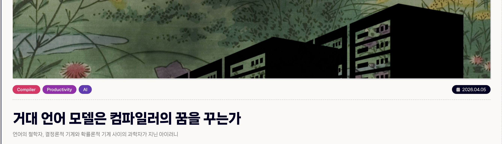
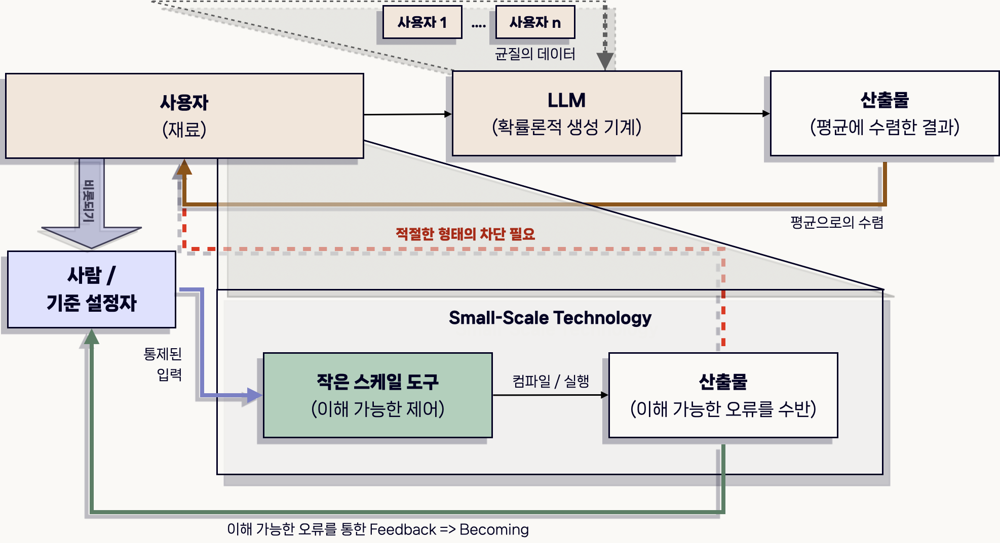

<blockquote style="padding: 1.5rem; background:transparent">
      
    <a href="https://www.instagram.com/daniela_zampieri/?hl=en-gb ">Daniela Zampieri</a> / <a href="https://betterimagesofai.org/images?artist=DanielaZampieri&title=TheAI-Deal">The AI-Deal</a> / <a href="https://creativecommons.org/licenses/by/4.0/">Licenced by CC-BY 4.0</a>
</blockquote>

## 기계가 마음이 되기를 바랐던 인간

컴퓨터 과학은 효율이 빚어낸 예술이다. 또한 마음이 기계가 되기 <h6>장피에르 뒤피 (Jean-Pierre Dupuy), 배문정 옮김 및 해설, ⌜마음은 어떻게 기계가 되었나(Aux origines des sciences cognitives)⌟(1994), 지식공작소, 2023</h6> 를 갈구한 학문이다. 반-자본주의 관점에서 보자면, 마음마저 착취하기 위한 새로운 공학의 가능성 중 하나였다고 평가할 수 있겠다. 반면 인간은 기계가 마음이 되기를 줄곧 바라 왔다. 확률적 앵무새 <h6>Emily M. Bender; Timnit Gebru; Angelina McMillan-Major; Shmargaret Shmitchell (March 2021), On the Dangers of Stochastic Parrots: Can Language Models Be Too Big?, Association for Computing Machinery,  doi:10.1145/3442188.3445922</h6>와 흐릿한 JPEG 이미지 <h6>Ted Chiang, ChatGPT Is a Blurry JPEG of the Web, Annals of Artificial Intelligence: The New Yorker, Published on Feb 9 2023, https://www.newyorker.com/tech/annals-of-technology/chatgpt-is-a-blurry-jpeg-of-the-web</h6>가 우리에게 도래하기 이전에도, 우리는 로봇을 만들어 왔다. 인간에게는, 인간이 아니지만 인간다운 존재를 창조하려는 - 빌렌도르프의 비너스로부터 이어진 - 욕구가 있다. 신에게 가까워지기 위해서인지, 자연이라는 불가역적 힘에 대항할 방법은 인간-이상의 피조물을 창조하는 수밖에 없다는 것을 일찍이 깨달은 탓인지. 이 불가사의를 분명하게 기술한 논리는 아직 찾을 수 없다. 현상만을 읽을 수 있을 뿐이다. 인간은 인간이 아닌 것 - 즉 기계 - 에게 마음을 주기 위한 방법을 끊임없이 고안해 왔다는 사실만이 우리 앞에 있다. 그러나 그 방법론들의 상류를 따라가 보면 흥미로운 역설을 발견할 수 있다. 기계에게 마음을 주기 위해, 인간은 마음을 기계로 만들어 오는 작업에 열중하고 있었다는 사실을.

 

마음을 기계로 환원하는 시도들은 크게 두 가지 우물에서 출발한다. 피드백 루프와 정보의 수량화가 바로 그것이다. 사이버네틱스(Cybernetics)가 창발한 이래 <h6>노버트 위너 (Norbert Wiener), 김재영 옮김, 「사이버네틱스: 동물과 기계의 제어와 커뮤니케이션 (Cybernetics: Or Control and Communication in the Animal and the Machine)」(1948), 읻다, 2023</h6> 인간과 기계는 피드백 루프(Feedback Loop) - 시스템의 출력이 입력으로 곧장 연결되어 더 나은 결과를 도출하게 유도하는 메커니즘 - 라는 큰 범주 아래 비슷한 개체로 취급되기 시작되었다. 또한 인간이 상호 교환하는 - 필연적으로 암묵지를 수반하는 - 정보에서 의미를 제거하여, 즉 연속적인(Continuous) 데이터 형태를 이산(Discrete)의 형태로 변환함으로써 커뮤니케이션의 효율성을 증대시켰다<h6>Claude E. Shannon, 「The Mathematical Theory Of Communication」, Bell System Technical Journal, 1948</h6>. 나쁜 출력을 장기적으로 더 좋은 성취로 잇는 이 반영구적인 루프 기관과, 정보를 수량화할 수 있는 이론적 체계가 구축된 뒤 흘러간 지난 80년을 생각해 보자. 기계에게는 몇 에포크(Epoch)에 해당할 지 모르는 긴 시간이었지만, 진화론의 지배 아래 있는 사피엔스에게는 턱없이 짧은 시간이었다. 즉 인지 시스템을 재구성하며, 또한 마음을 고려하기에는 찰나에 불과했다. 기술의 최전선에 있는 - 역시 사람인 엔지니어들에게도 마찬가지였다. 천공 카드 -> 어셈블리 -> 프로그래밍 언어 -> 자연어 입력으로 이어지는 소프트웨어 엔지니어링 / 컴퓨터 과학의 추상화 흐름은, 우리로 하여금 더 큰 시스템 - 현대 자본주의가 사람의 마음을 고려하지 않은 채 그저 인간을 '추상화 적응' 기계로 만든 건 아닌지 따져 묻게 만든다.

 

거대 언어 모델(이하 LLM)로 대변되는 동시대의 스케일-기반 기술은 기계가 마음이 되기를 바라는 인간의 근원적 욕망을 담은 추상화 열차의 종착지이다. 열차가 종착역에 다다라서는, 자본주의의 종말보다 세계의 종말을 상상하기 더 쉬운 시대<h6>마크 피셔 (Mark Fisher), 박진철 옮김, ⌜자본주의 리얼리즘: 대안은 없는가(Capitalist Realism)⌟(2009), 리시올, 2025</h6> 의 흐름을 타고, 인간을 피드백 루프의 재료로 전락시키기에 이르렀다. 인간이 자본주의와 스스로의 노동을 영속시키기 위해 생산했던 코드와 문서들은, 거대 스케일의 블랙박스로 흘러가, 자신의 주체성을 위협하는 물음표로 재탄생했다. 그렇다면 우리는 이 매체-기술이 주는 물음표에 어떻게 답해야 할까. 인간의 생산물을 재료로 가속하는, 자본주의를 그 자체로 탈은폐<h6>하이데거는 “하나의 세계 구성으로서의 기술”이라는 관점 아래 현대 기술에 대한 논의를 전개하였다.   그는 기술을 “단지 인간적인 산물”만이 아닌 일차적으로 전제하는 역사적 현상이며 “완성된 형이상학”임을 강조하는데, 특히 현대 기술을 ‘탈은폐(脫隱蔽, Entbergung)’의 방식으로 정의하며 기술의 본질이 갖는 의미를 서술한다.  

탈은폐란, 말 그대로 은폐된 상태에서부터 벗어나는 일 정도로 풀이할 수 있을 것이다.   그는 “어떤 것을 그 자리에 없던 상태에서 그 자리에 있음으로 넘어가게 만드는 것을 야기시키는 모든 것은 포이에시스, 즉 밖으로 끌어내어 앞에 내어놓음이다”라고 설명하며 은폐성으로부터 비은폐성으로 끌고가는 일련의 행위에서 기술의 본질이 발견됨을 주장한다.    유원준, ⌜매체 미학 - 예술과 기술 사이에서⌟, 미진사, pp. 69-70</h6> 시키는 - 즉 드러내는, 이 기술의 가속에 대해 우리는 어느 지점에 멈춰 서서 어떻게 평가해야 할까. 그리고 어떻게 살아내야 할까.

이 아티클에서는 <u>(1) 프로그래밍 노동이 변화한 방식을 톺아보며 매체가 된 기술이 엔지니어의 주체성 개념을 어떻게 변화시켰는지</u>, <u>(2) 대형 언어 모델로 대표되는 최전선의 스케일-기반 기술이 사용자로 하여금 유기적인 창작을 유도하는 ‘책’의 역할을 대신하여, 엔지니어와 작가의 직업 주체성을 지키는 데 기여할 가능성이 있는지</u> 그리고 <u>(3) 작은-스케일 기술이 엔지니어 그리고 더 나아가 사용자의 규격화를 막는 완충 장치로 기능할 수 있는지</u>를 분석한다. 또한 효율-수량화-피드백 루프에서 벗어나 비효율적 존재로서 인간의 주체성을 지키기 위한 방안을 모색한다.

 

## 추상성 용광로에서 헤매기

Agentic Engineering(혹은 Coding)이라 하면, 말 그대로 프로그래밍을 LLM이라는 대리자 (또는 행위자)에게 맡기는 것을 의미한다. 즉 개발자들은 새로운 형태의 고용자 혹은 클라이언트가 되어, LLM에게 특정한 규칙 및 명령을 주고 이를 감독한다. Claude (Code)는, 지금까지는 Agentic Coding의 대명사 격으로 취급되고 있다. 챗봇(ChatBot)의 형태로 초기 LLM 시장을 지배했던 OpenAI의 GPT, 둘째 가라면 서러운 Google의 Gemini와 함께 시장을 삼분하는 모양새인데, Agentic Engineering이라 하면 Claude Code는 입방아에 가장 먼저 오르는 듯 하다. 그러나, 작금의 선두 지위가 탄탄한 것만은 아니다. 개발자들은 3대 LLM 중 새로운 버전의 모델이 출시되면, 자신이 짧은 시간 주력으로 사용한 모델과 비교하고, 같은 입력에 대해 ‘더 나은 결과’를 추출한다고 판단할 시 새로운 노선으로의 환승을 주저하지 않는다. 그리고 이 환승 주기는 세 회사의 경쟁이 심화될수록 점점 짧아진다. 무어(Moore's Law의 그 Moore)는 도대체 몇 수를 접고 들어가야 할 지 모를 법한, 이 믿기 힘든 속도의 사이클은 감히 미증유의 광경이다.

 

컴퓨터는 0과 1의 이진법 체계로 된 신호만을 처리할 수 있으며, 이 때문에 컴퓨터와 적절히 소통하려면 프로그래밍 언어를 이해하고 사용할 줄 알아야 했다<h6>김성우, ⌜인공지능은 나의 읽기-쓰기를 어떻게 바꿀까⌟, 유유, 2024</h6>. 하지만 코퍼스 언어학<h6>코퍼스 언어학은 실제 언어 생활에서 생성된 말뭉치(Corpus)를 컴퓨터로 정제 및 분석하여 언어의 규칙과 패턴을 연구하는 응용언어학의 한 갈래이다.   코퍼스 언어학의 기틀을 마련한 언어학자 존 싱클레어는 “함께 나오는 단어를 보면 그 단어를 알 수 있다”라는 말을 남겼다 (김성우, 같은 책).  코퍼스 언어학은 수많은 단어를 벡터화(Vectorize)해, 그 분포를 수학적으로 계산할 수 있도록 하는 이론적 토대를 제공함으로써 어탠션(Attention) 기반 트랜스포머 모델의 탄생에 직간접적으로 기여했다.</h6>을 이해한 기계가 인간의 언어를 코드로 바꾸기 시작하면서 컴퓨터 과학을 둘러싼 산업계와 학계의 지형은 송두리째 바뀌었다. '컴퓨터가 자연어를 알아듣는 것처럼 보인다.'라는 사실 자체만으로, 가장 무거운 미션은 닥쳐왔다. 개발자들은 자신의 의미를 지켜내기 위해서 프로그래밍 언어로 둘러싸인 엔지니어링의 리터러시를 해체하고 재구성해야 할 책무를 부여받았다. 러다이트의 정신이 새록새록 솟아나던 와중, 질문들이 머릿속에서 발화한다. <strong>자연어가 엔지니어링의 대상이 된 것일까. 코드를 작성하는 논리 엔진이자 한 소프트웨어에 대해 온전히 주체성을 가졌던 엔지니어는 이제 허상조차 남지 않게 될 것인가.</strong>    

GPU 및 AI 칩을 개발하는 빅테크, NVIDIA 사의 CEO 젠슨 황은 All-In Podcast에 출연해 다음과 같이 이야기했다.  

<blockquote style="padding: 1.5rem; background:transparent">
    “50만 달러 연봉의 엔지니어가 1년에 25만 달러어치 토큰도 사용하지 않았다면 저는 굉장히 심각하게 받아들일 겁니다.<h6>Lee Chong Ming, Jensen Huang says <strong>he would be 'deeply alarmed' if his $500,000 engineer did not consume at least $250,000 of tokens</strong>: Business Insider, Last Edited March 20, 2026, https://www.businessinsider.com/jensen-huang-500k-engineers-250k-ai-tokens-nvidia-compute-2026-3
</h6>”
</blockquote>

해당 발언은 - 구체적인 계산이 필요하겠지만 - 이제 동시대의 엔지니어라 하면 예전에 코드를 작성하는 것 이상으로 ‘제대로 된 자연어’를 컴퓨터에 입력하는 데 시간을 기울여야 한다는 의미로 해석된다. 즉 엔지니어가 생성하는 가치(즉 코드)의 대부분이 아직도 손끝에서 나오는 것이라면, 그는 더 이상 엔지니어로서 자격 미달이라고 이야기하는 것이다. 물론 NVIDIA 칩 판매를 정당화하는 사업가의 레토릭(Rhetoric)일 수 있다. 하지만 그의 발언 하나하나는 현대 실리콘벨리(Silicon Valley)의 주된 사고방식을 적나라하게 드러낸다. 새로운 추상화 계층에 적응하지 못한다면 당신은 패배자일 것이라는 캘리포니아 자본주의의 흔한 격언을 다른 방식으로 표현한 것일 수도 있다. 사실 추상화는 컴퓨터 과학에서 심히 자연스러운 과정, 즉 공기와도 같은 무엇이다. 컴퓨터를 옆에 둔 엔지니어들은 80년이라는 시간 동안, 0과 1의 복잡다단한 패턴을 추상화하려 많은 노력을 기울여 왔다. 그 노력의 결과로, 즉 비트와 인간 사이의 엄격한 커뮤니케이션 규칙을 정립하려는 시도로써 어셈블리, 포트란, C, 자바, 파이썬 등의 프로그래밍 언어(이하 PL)는 탄생했다. 그리고 그들은 인간 친화적인 PL을 비트로 바꾸고, 또 최적화하는 논리적 기계를 발명해 내었는데, 이를 컴파일러(Compiler)라고 한다. 엔지니어들은 꽤 긴 시간동안 이 컴파일러 위에서 코드를 작성해 왔다.   

하지만 컴파일러와 PL이 수행하는 추상화가 가지는 편의성과 LLM이 제공하는 그것은 근본적으로 다르다. 전자는 결정론적 기계가 추상성을 해체하지만, 후자는 확률론적 기계가 추상성을 해석한다. 해체는 규칙적인 행위이고, 해석은 주관적이며 매번 다른 결과를 도출하는 행위이다. 즉 해석의 결과가 작동하는 상황을 결정한다. 이는 프리드리히 키틀러(Friedrich Kitler)가 "매체가 우리의 상황을 결정한다"고 이야기한 일을 상기시킨다. <h6>프리드리히 키틀러, 유현주·김남시 역, 「축음기, 영화, 타자기(Grammophon, Film, Typewriter)」(1986), 문학과지성사, 2019, p.7.</h6>. 컴파일러는 우리가 구성한 상황, 즉 코드에 맞추어 소프트웨어의 작동을 결정하는 것이고 (고전적인 매체의 정의에 해당하는 것이고), LLM은 우리의 상황 - 더 나아가 작동까지 결정하는 것이다. <h6>데리다(Jacques Derrida)의 경우, 우리의 현재가 ‘기술-매체의 공정에 의해 인공적으로 재구성’된다고 설명하는데, 기술매체에 둘러싸여 살아가는 현대인의 모습을 떠올려볼 때 이는 그리 과장된 말처럼 느껴지지 않는다.   그러나 과거로부터 매체에 관한 우리의 보편적 인식은 이와는 대조적 입장으로 확인된다.  즉, 매체는 ‘우리의 상황을 결정하는 것’이 아닌 ‘우리의 상황에 맞추어 결정되는 것’이었다.    유원준, 같은 책, pp. 6-8</h6>

그렇다면 컴파일러와 LLM은 키틀러의 매체 삼분법에서 어디에 자리할까. 저장(Storage) - 전송 (Transmission) - 처리 (Procssing) <h6>프리드리히 키틀러, 같은 책</h6> 중, 이 둘은 모두 처리 기계에 해당한다. 그러나 하나는 투명하며, 다른 하나는 검은 장막으로 덮힌 기계이다. 컴파일러의 경우, PL을 어셈블리-바이너리로 변환하는 장대한 여정 동안 언제든 그 파이프라인 안쪽을 들여다 볼 수 있다. 더 명확하게는 - 최적화 상의 이점이 있어 구축된 - 여러 중간 표현 (Intermediate Representation, 이하 IR)을 통해 그 변환 과정을 명확하게 확인할 수 있다. 나아가 컴파일러 기술이 가진 핵심 원칙은 LLM과의 차이를 더 뚜렷하게 구성한다. 최적화를 통해 IR를 변경하는 일이, 기존 IR을 보존하여 실행하는 코드의 실행 결과를 변형하는 일이 되어서는 안 된다. 다시 말해 최적화는 모든 입력에 대해 동일한 출력을 보장하는 선 안쪽에서만 이루어져야 한다. 이 원칙을 **의미론적 동등성(Semantic Equivalence)** 이라 부르며, 이는 컴파일러 바로 위에 있는 개발자들의 주체성을 지탱하는, 컴퓨터-인간 사이 계약이기도 하다.

하지만 동시대 엔지니어들은 컴파일러와 마찰을 일으키지 않는다. 엔지니어들은 이제 LLM 위에 존재한다. LLM은 - 여타 딥러닝 모델들이 그렇듯이 - 어떤 과정을 통과하여 자연어를 코드로 변환하는지 알려주지 않는다. (설명 가능한 AI - xAI란 LLM에게 아직 지난하면서도 불필요한 과업에 불과하다.) IR처럼 변환 과정에 접근할 수 있게끔 하는 매끈한 인터페이스란 존재하지 않는다. 대신 인간이 그 의미를 짐작조차 하기 어려운, 부동소수의 바다가 있다. 인간의 평균-해류를 따라 흐르는 가중치의 바다가 있다. 그 바다 해수면에서 항행하는 우리 - 질문하고 답을 요구하는 우리는 매번 다른 물고기들을 만나며 표류한다. 이와 동시에 해류는 우리가 만날 수 있는 어류와 해온을 한정한다. 이 부분에서, 키틀러가 타자기를 분석했을 때 주목한 내용과 LLM이 겹쳐진다. 키틀러에게 타자기는 담론과 말이 가진 연속성을 이산 형태로 환원하는 기계-매체이다. 이 맥락을 동시대로 옮기면 LLM은 미리 설정한(Pre-trained) 통계 범위 안에서 자연어를 코드 혹은 다른 자연어로 변환하는 확률론적 타자기가 된다. 컴파일러나 기존 타자기와 다르게, 이 새로운 형태의 타자기는 사용하는 사람의 의도에 온전히 봉사할 수 없는 기계라는 것이다.

<strong> 그러니 LLM은 매체가 된 기계이며, 기술을 도구주의로 해석하는 데 반박할 수 있는 예시가 된다. </strong>  

또한 아무리 자연어가 평면화되고 구조화된다고 하더라도, 그것을 투입할 기계 자체가 검은 장막으로 덮여 있으며 또한 확률론적 메커니즘에 따라 작동한다면, 이는 일정 수준의 불안정성 및 불완전-최적화(Suboptimal)를 담보한다. 컴퓨터 과학과 엔지니어링의 패러다임 변환은 이 지점에서 다시 한 번 확인할 수 있다. 상황을 결정하는 도구 이상의 무언가를 도입함으로써, 코드를 직접 관찰하는 데 사용하는 시간을 포기하면서 - 실행 안정성을 일부 낮추는 한이 있더라도 - Utility per Joule(소모된 에너지 단위 당 창출되는 실질적인 가치)에 집중하겠다는 선언의 제창 말이다. 여전히 '가치' 창출에 소요되는 시간을 줄이는 데 몰두하겠다는 다짐은 덤이다. 그렇게 프로그램의 안정성과 PL의 논리적 정합성을 따지던 시대는 이제 막을 내렸다. 새로운 추상성의 용광로, 끊임없이 작동하는 커다란 인공지능의 피드백 루프는 코드를 정성스럽게 갈고 닦았던 개발자들을 시대의 저편으로 지워내고 있다. 그들을 재료로 성장하였음에도 불구하고.

<blockquote style="padding: 1.5rem; background:transparent">
    <strong> 아래 글에서 더 많은 질문에 대한 이야기를 나눕니다. </strong>  
    

  
    1. 거대 언어 모델(이하 LLM)이 컴파일러가 되려면, 컴파일러-인간 모두에 무엇을 전제해 두어야 할까요?  
    2. 컴파일러를 컴파일러라고 부를 수 있는 조건은 무엇일까요?  
    3. 자연어와 형식 언어가 갈라지는 지점은 어디일까요?  
    4. 개발자가 ‘코드를 작성하는 논리적 기계이자 의도를 가진 주체’에서 온전히 ‘자연어 입력 장치’로 환원될 경우 생각해 볼 수 있는 문제는 무엇이 있을까요?
</blockquote>

 

## 평균으로의 수렴을 피하기

<code class="language-text">추상성 용광로에서 헤매기</code>에서는 PL을 직접 관찰하는 행위를 더 이상 수행할 수 없게 된 엔지니어의 이야기를 다루었다. 그렇다면 소프트웨어 자체는 어떤가. Agentic Engineering으로 탄생한 소프트웨어를 엔지니어의 고뇌가 담긴 창의적 결과물로 인정할 수 있는가. 이 질문에 답해야만 동시대의 SW 엔지니어가 주체적인 사고를 지닌 존재인지를 판별할 수 있을 것이다. 또한 질문 - 답변 - 수정 요청 - 답변의 프로세스로 이어지는, LLM과 짝을 이룬 글쓰기가 과연 창작자의 주체성을 인정해야 할 창작물로 취급되어야 하는가를 물을 수 있다. 그리고 두 질문을 아울러 생각하면 - 거대-스케일 기술과 인간의 관계성에 공명하는 물음인 - 생산성을 위해서라면 인간은 주체성을 어디까지 양보할 수 있는가에 대해 소결을 내릴 수 있는 근거가 도출될 수 있을 것이다.

 

아르헨티나의 대문호 보르헤스는 인간이 가진 도구 중 가장 경이로운 것은 책이며, 나머지는 그저 신체의 확장일 뿐이라며, 책의 위대함을 역설한 적이 있다 <h6>De los diversos instrumentos del hombre, el más asombroso es, sin duda, el libro.

Los demás son extensiones de su cuerpo.   El microscopio, el telescopio, son extensiones de su vista; el teléfono es extensión de la voz; luego tenemos el arado y la espada, extensiones de su brazo.  

Pero el libro es otra cosa: el libro es una extensión de la memoria y de la imaginación.   Jorge Luis Borges, ⌜Borges, Oral⌟, (Buenos Aires : Emecé Editores), 1979</h6>. 그렇다면 그 경이로워 마지않는 책을 읽고 쓴다는 건 무엇을 담보하는 일인가. 바로 - 고대 그리스에서부터 철학의 주요 주제였던 - ‘존재와 생성’에서의 생성 (becoming)에 밑바탕을 둔 일이라는 것이다 <h6>김성우, 같은 책</h6>. 글을 읽는 동안 사고한 내용이 바로 다음 텍스트를 해석하는 데 영향을 주고, 글을 쓰며 물화된 문자의 집합이 바로 다음 텍스트를 작성하는 데 영향을 준다. 즉 책을 읽고 쓴다는 건 이 끝없는 되먹임 과정 속에서, 내가 내 자신임을 감각하는 데 초점이 맞추어진 행위이다. 상상의 물화(generating)는 내가 가장 나답게 되어가는(becoming) 과정에 꾸준히 기여한다. 그렇게 읽고 쓰는 인간은 이 자연스러운 피드백 루프를 통제할 수 있는 권한을 가지게 된다. 반면 LLM과 짝을 이룬 언어 생산의 경우 사고와 쓰기를 명백하게 구분할 수 있다<h6>김성우, 같은 책</h6>. 첫 질문을 입력하기 위해 사고하고 이를 물화시키는 행위와 LLM의 쓰기 행위는 온전히 분리되어 있다. 질문과 응답의 쌍이 존재할 뿐, 저 응답이 나로부터 비롯된 게 아니므로 becoming에 기여하지 못한다. 이는 또한 개인의 성장의 차원을 넘어서, 인간 언어의 본질적 다양성을 통계적 평균으로 압축한다는 더 근본적인 문제를 내포한다. 개인의 문체란 평균으로부터 얼마나 어떤 방향으로 벗어나 있는지를 가진 벡터에 빗댈 수 있다. 대문호라 불리는 작가들은, 당연하게도 통계적 중앙값의 정서를 그려내지 않는다. 고유의 벡터를 잃고 스스로가 통제할 수 있는 피드백 루프를 벗어나게 된다면, 과정도 그리고 그 결과물도 주체성으로부터 비롯된 것이라 말할 수 없다.

 

그렇다면 여기서 첫 번째 질문으로 돌아가자. Agentic Engineering으로 탄생한 소프트웨어는 창의적 결과물로 인정할 수 있을까. 본래 창작이란 무엇인지부터 살펴보자. 예술사에서 창작은 오랫동안 구상(conception)과 실행(execution)의 통일로 이해되어 왔다. 조각가는 대리석을 어떻게 깎을지를 구상하고, 그 구상을 손으로 직접 실현한다. 두 행위가 한 인간 안에서 통합되어 있을 때 우리는 그것을 창작이라 부른다. 그런데 영화감독은 어떤가. 그는 구상하지만 카메라를 직접 조작하지 않는다. 배우의 연기를 직접 수행하지 않는다. 그럼에도 우리는 그 영화를 감독의 창작물로 인정한다. 왜인가. 핵심적인 미적 결정들 — 무엇을 찍을지, 어떻게 편집할지, 어떤 감정을 만들어낼지 — 이 감독으로부터 비롯되었기 때문이다.<h6>감독을 개발자, 배우를 확률론적 기계인 LLM Agent라고 생각하면, 영화를 동시대의 소프트웨어로 빗대는 것이 꽤나 들어맞는 비유가 된다.   즉, 감독을 Harness Architecture의 Orchestrator라고 이야기할 수도 있다. 물론 감독은 LLM Agent에게와는 다르게 암묵지가 수반된 - 훨씬 추상적인 지시를 스태프와 배우들에게 전달한다. </h6> LLM에게 코드 생성을 맡기는 엔지니어에 이와 같은 기준을 적용해 보자. 어떤 알고리즘이 이 문제에 적합한지, 왜 이 자료구조가 선택되어야 하는지, 이 최적화가 어떤 트레이드오프를 수반하는지를 그가 이해하고 있는가. 만약 그렇다면, 그의 소프트웨어는 창의적 결과물이라 말할 수 있다. 그러나 LLM이 생성한 코드를 그 구조적 이유를 이해하지 못한 채 채택한다면, 그것은 감독이 아니라 제작자(producer)에 가깝다. 결과물을 소유하지만, 그것을 생산한 사유는 소유하지 못한 존재. 창의성의 조건은 결과물에 대한 소유권이 아니라, 그 결과물에 이르기까지의 결정들이 이루는 연쇄 고리를 이해하고 있느냐에 달려 있다.

 

그렇다면 생산성을 위해서 인간은 자신의 주체성을 얼마나 양보할 수 있는가. 이는 글과 코드를 읽고 쓰는 수많은 사람들 각자가 다르게 판단할 문제이나, 필자는 결국 자신이 보기에 ‘핵심적인 결정’을 내릴 수 있는 환경 안에서 주체성과 생산성의 경계가 결정되어야 한다고 본다. 다르게 말하면 구상과 실행을 어느 지점에서 구분할 것이냐의 문제이다. 생산성에 치우치게 되면, 평균의 매뉴얼대로 찍어낸 상품이 되고, 주체성을 강조하게 되면 창의적 결과물로 판단할 수 있음은 자명하다. <strong> 그렇다면 당신은 - 시간은 금이라 말하는 곳에서 -  스스로에게 발산을 얼마나 허용할 것인가. 평균으로부터 멀어지기로 결심했다면, 어느 속도로 그리고 어떤 방향으로 멀어질 것인가. </strong>

 

## 작은-스케일 기술을 생각하기

<code class="language-text">평균으로의 수렴을 피하기</code>에서 제시한 마지막 질문에 대한 대답을, 본 보고서에서는 작은-스케일 기술을 제안하는 것으로 갈음하려 한다. 여기서 작은-스케일 기술이란, 큰 수의 법칙에 의해 평균으로 수렴할 수 밖에 없는 스케일-기반 기술의 반대편에 자리한다. 평균으로부터의 멀어짐, 발산의 한 방식을 정의한 것이다. 이는 단순히 규모가 작은 소프트웨어나 시스템을 의미하지 않는다. 그것은 사용자가 그 내부 작동 원리를 이해하고 통제할 수 있는 기술 - Black-Box로 작동하지 않는 기술을 가리킨다. 이 기술에 대한 이해와 앎은, 단순히 지식으로 치환되는 것이 아니라, 기술에 대한 주권을 견지하고 있음을 보여주는 증표다. 그렇다면 작은-스케일 기술은 어떻게 이 주권을 보존하는가. 작은-스케일 기술의 세 가지 철학적 기둥을 상정하며 구체화해 보자.

 

<strong>첫째, 마찰(friction)을 보존한다.</strong> 복잡한 프로그래밍 언어를 익히고, 컴파일러의 오류 메시지를 해석하고, 최적화 알고리즘을 직접 구현하는 과정은 분명히 비효율적이다. 그러나 이 마찰이야말로 엔지니어를 성장시키는 본질적 조건이다. 마찰 없는 인터페이스는 사용자를 편안하게 만들지만, 동시에 그를 표면에 머무는 존재로 만든다. 자연어 입력으로 모든 것이 해결되는 환경에서 엔지니어는 더 이상 기술의 깊이를 내면화할 기회를 갖지 못한다.

<strong> 둘째, 이해 가능한 오류의 가치를 존중한다. </strong> 작은-스케일 기술은 실패할 때 이해할 수 있는 방식으로 실패한다. Segmentation Fault는 맞이하기에 두렵기 그지없지만, 적어도 그것은 메모리 영역을 잘못 참조했다는 구체적인 정보를 준다. 로그를 읽고 해석하며 코드의 대안을 상상한다. 반면 LLM이 생성한 코드의 오류는 왜 그것이 오류인지를 추적하기 어렵다. 로그도 에이전트가 알아서 분석하며 - 알아서 해결한다. 클라이언트-엔지니어는 오류의 원인을 파악하지 못하고, 최적의 비용을 지닌 해결책을 알아채지 못한다. 이해 가능한 실패만이 대안을 상상하게끔 하며, 결과적으로 Becoming에 기여한다.

<strong>셋째, 개인화된 추상화(personalized abstraction)의 가능성을 상상한다.</strong> 자신이 직접 작성한 라이브러리, 자신의 코드베이스에 맞게 설계한 도구들은 그 엔지니어의 사고방식을 물질화한 결과물이다. 이는 보르헤스가 책에 대해 이야기했던 것과 동일한 맥락에서 이해할 수 있다. 자신이 만든 도구를 사용하는 것은 자신이 쓴 글을 다시 읽는 것과 같다. 그것은 becoming의 피드백 루프를 외부의 계와 차단하는 행위이다. 

즉 여기서 개인화란, 뻔한 평균으로의 수렴이 아닌 그 누구와도 다른 - 독특한 스스로로 향하는 수렴을 의미한다. 평균으로부터 멀어지려는 적극적인 시도이자, 엔지니어 자신이 거대한 피드백 루프의 재료가 아니라 작은 피드백 루프의 주인임을 선언하는 행위이다. 다른 모든 이가 동일한 LLM 인터페이스를 통해 수렴하는 - 또한 닮은 코드를 생성(Generating)할 때, 자신은 닫힌 계의 추상화 규칙을 직접 설계하며 대안적 가능성을 실현하는 동시에 그 자체로 대안적 엔지니어로 비롯(becoming)된다.

하지만 여기서 반론을 정면으로 직면해야 한다. 작은-스케일 기술로의 회귀가 낭만적인 복고주의에 불과한 것은 아닌가. 대형 언어 모델이 이미 현실이 된 세계에서, 그것을 사용하지 않는 것은 경쟁에서의 자발적 퇴장이 아닌가. 이 반론은 - 자본주의 아래서는 - 정당하다. 그러나 선택지는 이분법적이지 않다. 작은-스케일 기술을 연마하는 것은 LLM을 전면 거부하자는 주장이 아니다. 그것은 LLM을 사용하더라도 자신의 기술적 기반을 보존하고, 도구를 통제하는 주권을 포기하지 말자는 제안이다. 모든 것을 LLM에게 맡기기 전에, 적어도 그것이 무엇을 하고 있는지를 판단할 수 있는 능력을 스스로 갖추어야 한다는 것이다. 작은-스케일 기술은 그 판단력을 유지하기 위한 훈련장이면서, 가속에 휩쓸리지 않을 벙커이다.

 

## 비효율을 꿈꾸게 된 인간

<blockquote style="padding: 1.5rem; background:transparent">
        

 
    벤야민도 아도르노도 이 사회를 신화 세계라고 얘기합니다.  
계몽된 사회가 아니라 전부 몽매한 무엇에 묶여서 꼼짝도 못 하는 사회,  객관적 권력의 메커니즘 속에서 개인이 하나의 톱니바퀴로 살아가는 사회를 신화 사회라고 불러요.  
계몽 세계가 아니며 근대 세계가 아니며 리버럴리즘의 세계가 아니라고 얘기합니다.  
지금 우리 사회의 모습이 다릅니까? <h6>김진영, 「상처로 숨 쉬는 법」, 민음사, 2021, p.630</h6>
</blockquote>

 

**비효율을 지키려는 욕망은 과연 진보적인 것인가**, 아니면 변화를 두려워하는 인간의 본능적 보수성에 불과한 것인가. 이 질문을 회피하는 것은 지적 불성실이다. 기술의 역사는 비효율을 제거해 온 역사이다. 말이 자동차로 대체된 것을 애도하는 것이 낭만적 감상이듯, LLM 이전의 엔지니어링 방식을 고수하는 것 역시 감상적 집착일 수 있다. 하지만 **이 질문**의 프레임에 갇히게 되면, 반동에 쉬이 마음을 주지 않는 사람들에게 추상화는 필연적인 역사의 흐름이라는 인식을 굳히는 효과를 줄 뿐이다. 연속하는 상실에 반항하는 것은 - 또한 상실되어 가는 것을 보존하려는 노력은 지금-여기에서 가치 판단을 수행했을 때 분명 후순위로 밀려난다. 지금-여기에서는 전체 순위표를 볼 수 없는 목록이 끝없이 수정되고 있다. 그러니 우리는 이 목록에서 벗어나 생각해야 한다.<h6>우리가 누군가를 사랑할 때, 우리는 그를 특징짓는 목록들을 사랑하는 것이 아니다.

비록 그 목록이 그 사람을 다른 사람과 완벽하게 구분하고, 세세한 특징들을 다 포함한다고 해도 그렇다.  

제우스는 암피트리온의 실체가 아니라 모사(시뮬레이션)다.

모사는 실체의 특징들을 가질 수 있고, 그 목록은 충분히 완전할 수 있다.

 하지만 가장 완벽한 모사도 그 '무언가(Something)'를 포착하는 데는 실패한다.  장피에르 뒤피, 같은 책, pp.LX-LXI</h6> 우리의 욕망이 - 욕망을 가속화하는 목록이 - 우리를 어디로 이끌었는지를 물어야 한다. 목록을 작성하는 데 가장 앞장섰던 엔지니어가 가장 적극적으로 손을 들어야 한다.

 

피치 못하게 - 효율의 극대화가 가져온 세계에서 무엇이 사라졌는지 생각해 보자. 마크 피셔는 우리가 자본주의의 종말보다 세계의 종말을 더 쉽게 상상하게 된 이유가 대안적 상상력 자체의 고갈에 있다고 진단했다<h6> Fisher, 같은 책 </h6>. 효율을 최우선 가치로 삼는 시스템은, 그 시스템 자체를 의문시하는 능력마저 효율화한다. 느리게 생각하는 능력, 우회하는 능력, 다르게 생각하는 능력을 제거한다. 이 세계에 대항하며 자연스레 비효율을 꿈꾸게 된 인간은 단순히 속도에 저항하는 인간이 아니다. 그는 자신이 어디에 있는지를, 무엇을 하고 있는지를, 왜 그것을 하고 있는지를 감각하려는 인간이다. becoming의 과정을 자신의 손 안에 두려는 인간이다. 그리고 하나의 인간이 아니라 여럿의 인간이다. 그 실천을 공유하는 인간이다. 서로의 Becoming을 목격하는 인간이다.

LLM이 제공하는 즉각적인 답변은 질문하는 고통을 덜어주지만, 동시에 질문을 통해 자신이 무엇을 모르고 있는지를 발견하는 기쁨도 함께 가져간다. 디버깅이 지루한 이유는 그것이 비효율적이기 때문이지만, 그 지루함을 통과한 뒤 얻는 통찰은 어떤 LLM도 대신 제공할 수 없다. 왜냐하면 그 통찰은 코드에 대한 것이 아니라, 그 코드와 씨름한 자신에 대한 것이기 때문이다. 그리고 그것은 목록으로 작성할 수 있는 무언가가 아니다. 또한 신속한 응답은 타인의 생성에 귀 기울일 기회도 앗아간다. 타인이 씨름했던 이야기를 읽고 듣지 않는다면 우리는 읽기로부터 비롯하는 생성을 더 이상 체험하지 못할 것이다.    

 

서두에서 밝혔듯 인간은 기계가 마음이 되기를 바라 왔다. 그 저항할 수 없는 흐름 속에서, 거대 언어 모델은 인간의 언어를 자연스레 발화하여 그들의 마음을 얻는 기계가 되었다. 하지만 그 대가로 인간은 거대한 피드백 루프에 포함되어, 매트릭스의 일부가 되기를 강요당하고 있다. 그 반대편에서 일어나는 일은 더욱 모순적이다. 구조화된 프롬프트, 명확한 명령, 측정 가능한 산출물 - 즉 자연어의 틀을 쓴 형식 언어를 LLM에 성심성의껏 입력함으로써 인간은 점차 기계가 되어간다. 추상화의 흐름 - 기계에게 마음을 주려는 시도 속에서, 인간은 자신의 마음을 기계로 만들어 온 것이다. 이 두 가지의 커다란 역설이 지금 우리 앞에 있다.  

비효율은 이 연쇄로부터 탈출하는 유일한 통로이다. 스스로가 재료가 되는 파드백 루프를 벗어나, 자신만의 루프를 구축하는 길이다. 그럼으로써 스스로가 아직 기계가 아님을 확인하는 행위이다. 기계 위에서 - 기계의 주인임을 선언하는 행위이다. 틀리고, 돌아가고, 막히고, 다시 시작하는 그 과정에서 인간은 스스로가 생성 중임을, becoming 중임을 증명한다. 효율적 존재는 항상 곧은 방향으로 가속하지만, 비효율적 존재는 끊임없이 다른 존재와 부딪혀 가며 경로를 다시 탐색한다. 그것이 이 비효율적 논리 엔진이 가진 특장점이다. 부딪힘으로써 가속을 저지하고, 다른 방향의 벡터를 생성하며, 평균으로부터 멀어진다.  

<blockquote style="padding: 1.5rem; background:transparent">
    우리는 비결정적인 미래에서 이룰 결정적인 승리를 위해 싸우고 있는 게 아니다.  
    존재를 지속하는 것만이 우리가 할 수 있는 가장 위대한 승리다.  
    어떤 패배도, 우리의 생존에는 아무 관심도 없는 이 무심한 우주에서 우리가 한동안 존재했었다는 그 성공을 빼앗아 갈 수 없다.   

    <h6>장피에르 뒤피, 같은 책, p.371 에서 재인용. (원문 : 노버트 위너의 자서전 ⌜나는 수학자다⌟)</h6>
</blockquote>

비결정적인 미래 (LLM이 생성해주는 미래)에서 이룰 수 있는 결정적인 승리란 과연 무엇일지. 그 자리에 어떤 설명이 붙여지더라도, 우리가 차지할 수 있는 가장 위대한 트로피는 '존재를 지속했음'을 알리는 트로피이다. 우리 스스로 결정하고 실패하며 다시 시도했음을 알리는 트로피이다. 불확정성과 이에 수반되는 불규칙성에 맞서 단단한 비효율의 규칙 - 조직화의 영토를 구축하려는 시도 그 자체이다. 그러니 비효율을 꿈꾸자. 비효율을 상상한 뒤에야 우리는 LLM을 손의 확장으로 사용할 수 있을 것이다. 상상이 수반되지 않은 도구란 무의미하기 때문이다. 그리고 우리가 살아있었다는 것을 증명하기 위해 잠시 숨을 돌리고 비효율을 꿈꾸자. 멈춤의 이야기를 나누려 애를 쓰고 타인과 마주하자. 생산성 늪에서 우리의 불을 피울 방편은 이것 뿐이니까.