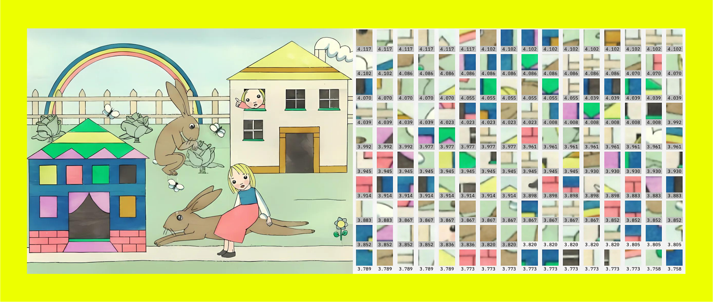

<blockquote style="padding: 1.5rem; background:transparent">
    

        
    

     
    
        <a href="https://nadiapiet.com/">Nadia Piet </a> &amp; <a href="https://aixdesign.co/posts/archival-images-of-ai">Archival Images of AI + AIxDESIGN</a> / <a href="https://betterimagesofai.org/images?artist=NadiaPiet&title=WaysofSeeing">Ways of Seeing</a> / <a href="https://creativecommons.org/licenses/by/4.0/">Licenced by CC-BY 4.0</a>
    
    

</blockquote>

## 또다시 푸른밤

   옥상달빛 누나들이 진행했던 라디오 “푸른밤”에서는 매주 목요일마다 ‘다 틀어주고 싶은 밤’이라는 코너를 진행했었다. 수요일에서 목요일로 넘어가는 자정에 시작된 회의가 끝나면 비로소 주제가 정해진다. 방송 시작과 함께 디스크자키가 주제를 이야기하면, 백일장이라도 된 듯이 청취자들은 자신의 삶이 깊이 투영된 음악을 짤막한 글과 함께 쏟아낸다. 음악을 중심축으로 둔 대부분의 라디오 프로그램은 사연과 함께 신청곡을 받는다. (사실 ‘컬투쇼’와 같은 프로그램이 아니라면 열에 아홉은 그러하다.) 하지만, 이 세상 모든 라디오 프로그램을 들어 본 건 아니라 함부로 규정짓는 데에는 자신이 없으면서도, ‘다틀밤’은 여러 의미에서 독특했다. 매주 발행되는 음악 잡지와 비슷한 구석이 있었다. 이번 주에는 어떤 주제로 두 시간이 채워질까. 어떤 서사가 흘러나올까. 무슨 음악이 내 삶을 무심코 훑어 갈까. 편집장은 PD님께서 맡고, 청취자들은 모두 기자가 되어 그 주의 지면에 실리려 혈안이 되었다. 그러니 가끔은 엉뚱한 주제가 나오는 바람에, 문자를 써 내는 데 골치가 아프면서도, 주간 백일장을 고대했다. 금요일이 아니라, 주말이 아니라, 목요일 밤을 기대하게 만드는 매력이 이 잡지에는 있었다. 한 번은, 다음주에는 어떤 이야기를 들을 수 있으려나 노심초사 하던 차에, ‘다틀밤’의 주제를 무심코 제안한 적이 있다. 오래 전이어도 좋고, 당장 몇 시간 전이라도 좋으니,  그때의 나에게 들려주고픈 노래를 선곡해 보자는 취지였다. 무심코 던진 문자에, 제작진의 차주 수요일 퇴근은 앞당겨졌다. 2022년 4월 7일의 밤도, 여느 때의 목요일처럼 라디오에는 조잘거림이 가득했다. 나는 특별 편집장 자격으로 내 글을 마음대로 실을 수 있었다. 다음주에 다시금 돌아올 마감에 머리 한 편이 아려오면서도, 삶에 오늘 같은 날이 가끔은 찾아와 주기를 고대했다. 

 

## 잊혀질 운명

   그러다 국방의 의무 탓에 작가 부업을 잠시 내려놓은 이듬해 가을, 라디오는 문을 닫았다. 그리고 내 목요일은 사라졌다. 라디오 없는 삶이라니, 돌아가야 할 고향이 댐 밑으로 가라앉는 것만큼이나 냉혹했다. 더 잔인했던 건 심야 라디오에는 전혀 걸맞지 않은 총체적 시설의 규율이었다. 그토록 저녁에는 어떤 전자기기든 소지할 수 없었으니 말이다. 생방으로 듣지 못하는 통에, 마지막 이야기를 팟캐스트로 들을 수 밖에 없었다. 팟캐스트에서는 음악이 잘려 나오지만, 뭐 어쩌겠는가. 노래를 소개하는 멘트는 편집되지 않으니 스트리밍의 힘을 빌리는 수 밖에. 울다가 웃다가 정신없던 와중에 한 가수의 목소리가 가슴을 움켜쥐었다. 이상은의 “둥글게”라는 곡이었다. PD님의 선곡으로 기억한다. 가사가 그의 애정어린 프로그램에 대한 헌사를 대신했다. ‘둥글게 모여앉아 행복했던 작은 가게가 문닫자 처음 눈물을 보인 너 … 혹시 내가 오래도록 기다려왔던 그 사람이 너일지도 몰라서’ 눈물샘이 그날만큼 전력을 다해 일했던 사례를 목격한 적이 아직까지는 없다. 음성이 이어폰에서 흘러나오기를 멈추고, 눈물 공장이 휴지기에 들어갔을 때 비로소 깨달았다. 세상에 배경음악이란 없다는 사실을. 사람이 존재하고, 이야기가 존재한 뒤에야 음악이 존재할 수 있음을 실감했다. 이야기가 결여된 음악을 들으며 눈물을 맺히기란 여간 쉬운 일이 아니다. 가수의 목소리가 삶에 덧입혀질 때, 청자들은 그 사람을 달팽이관 안쪽에 고이 모셔 둔다. 기쁨과 슬픔을 함께 나누고, 달팽이관에 가수를 쟁여 두고, 잡지를 만드는 일. 그 모든 일들이 벌어지는 곳이 ‘둥글게 모여앉아 행복했던 작은 가게,’ 푸른밤이라는 라디오였다. 본래 한 사람의 목소리를 먼 곳까지 전파시키는 데 주안을 두었던 라디오는, MTV와 인터넷 그리고 관심경제 플랫폼에 밀리고 밀려 잊혀질 운명이었다. 그러나 살아남아야 했다. 그에게 생계를 거는 사람이 많았다. 사람들로부터 살아남기 위해선 단순 정보 전달의 목적을 뛰어넘은, 다른 형태의 설득을 할 필요가 있었다. 새로운 미디어 세계에 쉬이 정착하지 못한 사람들을 위해 쉼터를 만드는 일은 그러한 설득의 방편 중 하나였고, 나는 그 공간의 이유를 납득하는 걸 넘어서, 그 존재에 애착이 생겨버린 터였다.

 

## 너는 나를 알지 못한다

   어떤 스트리밍 플랫폼은 ‘나보다 나를 잘 아는’이라는 수식어구를 캐치프레이즈에 포함시켜 그들을 홍보 중에 있다. 그 문구에 대해 과대광고라며 불매운동을 펼 생각 따위는 추호도 없다. 하지만 저기 있는 ‘나’라는 집합에서 나는 좀 빼 주었으면 한다. 일단 나는 나를 모른다. 어떤 음악이 나를 스쳐가 내 삶의 양태를 바꿀지, 이미 어떤 음악이 내 삶을 바꾸었는지 명확하게 서술하지 못한다. 최소한 나에게는, 누군가가 “나는 너보다 너를 잘 안다”고 이야기하는 일이 섬뜩하기만 하다. 나도 나를 모르는데, 넌들 나를 알겠느냐 말이다. 그리고 너는 나의 이야기를 모른다. 내가 왜 이 음악을 플레이리스트에 담았는지, 타인의 이야기에 어떻게 감동을 받았는지, 사연에 덧붙인 음악에 왜 나를 투영할 수 있었는지, 너는 모른다. 장피에르 뒤피의 말마따나 너는 나를 “묘사하는 특징의 목록”만을 가지고 있을 뿐이다. 나의 모사를 알 뿐, 나를 둘러싼 ‘무언가(Something)’을 포착하지는 못한다. 이야기와 음악, 사람 사이를 느슨하게 매듭짓는 무언가를 너는 알지 못한다. 그 무언가에 대한 힌트조차 내가 몸담았던 공간만이 어렴풋이 추측해 볼 수 있을 것이다. 그 공간에서 함께 떠들었던 사람들의 서사 속에 민들레 상투털처럼 흩날려 있을 것이다. 나는 가끔 문자로부터 말미암은 사람이라고, 친밀한 사람들에게 이야기하곤 한다. 오늘 새롭게 만들어진 이 문자의 집합에서는 또 하나를 주창해야 할 듯 싶다. 나는 라디오로부터 비롯된 인간이라고, 언젠가는 사라질 잡지에 글을 투고했던 사람이라고, 가끔은 편집장도 맡았었다고 말이다. “나는 너보다 음악을 많이 알 수는 없을 테야. 하지만 내가 너보다 음악을 더 잘 안다고도 할 수 없을 테지. 하지만 나는 공간의 일원이자, 가끔은 공원을 만들 수도 있었어.”

